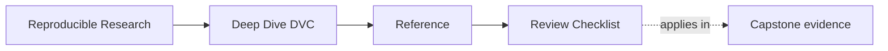
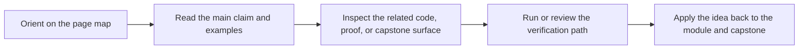

# Review Checklist

<!-- page-maps:start -->
## Page Maps

<!-- page-maps:end -->

Use this checklist when reviewing a DVC repository, module exercise, or capstone change.
The goal is to leave with explicit keep, change, or reject calls rather than vague trust.

## State authority

- Which surface is authoritative for this question: declaration, recorded execution, promotion, or recovery?
- Do `dvc.yaml`, `dvc.lock`, and promoted outputs still tell compatible stories?
- Is any visible workspace file being treated as authority when it is only convenience?

## Comparability

- Which params and metrics are supposed to remain semantically comparable?
- Has a changed parameter or metric altered meaning without being named as a boundary change?
- Is an experiment being judged against a stable baseline rather than folklore?

## Evidence types

- Are you reading declaration, recorded execution, comparison, promotion, experiment, or recovery evidence?
- Does the current evidence type actually settle the question being asked?
- Has any stronger claim been attached to evidence that only supports a narrower boundary?

## Promotion and recovery

- Which artifacts are safe for downstream trust?
- Which guarantees depend on the remote rather than the local cache?
- Would another maintainer know what survives local loss and why?

## Stewardship

- Which command or bundle should a reviewer trust first?
- Which file would you inspect before approving the next non-trivial change?
- Which ambiguity would you force the author to make explicit before accepting the repository?
