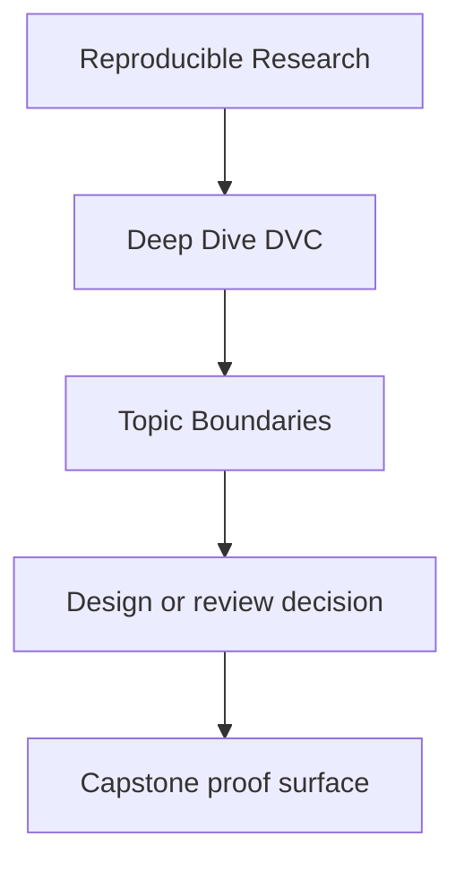
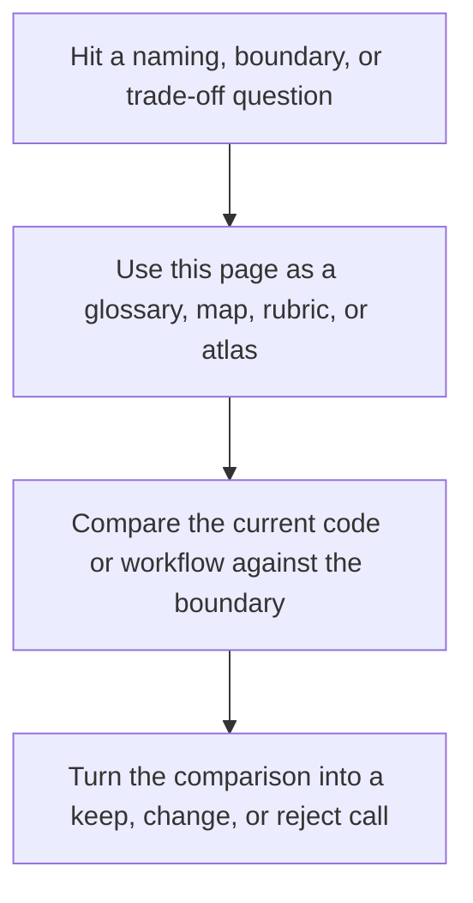

# Topic Boundaries

<!-- page-maps:start -->
## Reference Position

<!-- page-maps:end -->

Read the first diagram as a lookup map: this page is part of the review shelf, not a first-read narrative. Read the second diagram as the reference rhythm: arrive with a concrete ambiguity, compare the current work against the boundary on the page, then turn that comparison into a decision.

This page answers a question the course currently implies more than it states: which DVC
topics are central to this program, which ones support the core, and which ones are
deliberately treated as boundaries rather than as the center of the curriculum.

Use it when the course feels selective and you want that selectivity to be explicit
instead of accidental.

---

## Core Topics This Course Must Teach Well

These are the non-negotiable topics. If these stay fuzzy, the course is not doing its
job.

| Topic family | Why it is core | Primary modules | Typical proof |
| --- | --- | --- | --- |
| state identity | reproducibility collapses when location is mistaken for identity | 01, 02 | authority map, lockfile and cache inspection |
| environments as declared inputs | execution context must be part of the state story | 03 | verification routes, capstone confirm |
| truthful DVC pipelines | stages, deps, outs, params, and metrics must tell one consistent story | 04, 05 | `dvc.yaml`, `dvc.lock`, verify routes |
| controlled experimentation | baseline history must survive parameter variation | 05, 06 | experiment review bundle |
| collaboration and recovery | teams need state that survives handoff and cache loss | 07, 08 | recovery review, release review |
| promotion and downstream contracts | published state must stay smaller and clearer than the working repo | 09 | publish and release audit routes |
| governance and tool boundaries | stewardship requires knowing where DVC should stop owning the problem | 10 | confirm route, governance review |

[Back to top](#top)

---

## Supporting Topics That Matter, But Serve The Core

These matter because they make the core topics legible and enforceable.

| Topic family | How this course uses it | Where it appears |
| --- | --- | --- |
| Git history | to anchor state authority and promotion decisions | Modules 02, 07, 09 |
| manifests and reports | to make published state reviewable | Modules 05, 09 |
| metrics and params files | to keep comparisons semantically honest | Modules 05, 06 |
| remotes and caches | to separate local convenience from recoverable truth | Modules 02, 08 |
| review bundles | to turn repository claims into inspectable evidence | Modules 06, 08, 09, 10 |

These are important, but they are always in service of a more trustworthy state model.

[Back to top](#top)

---

## Boundaries This Course Names Deliberately

These topics are real, but they are not treated as the main point of Deep Dive DVC.

| Boundary topic | Why it is not the center of this course | What we do instead |
| --- | --- | --- |
| ML modeling depth | this course is about state truth, not model theory | keep the model simple and use it as pressure, not as the main subject |
| cloud storage administration | remotes matter as durability boundaries, not as the full course topic | teach remote-backed recovery and promotion review instead |
| Git branching strategy in the large | Git matters where it changes state authority and promotion meaning | keep focus on reproducibility contracts, not general Git process advice |
| notebook craft | notebooks may exist, but they are not the authoritative state boundary here | teach committed data, params, metrics, and published outputs instead |
| general data-platform architecture | DVC has limits and neighbors | Module 10 teaches tool boundaries instead of pretending DVC should own everything |

When a learner wants more on one of these, the honest answer is not “the course covers
everything.” The honest answer is “the course touches this where it affects state truth,
then hands off.”

[Back to top](#top)

---

## Topics People Often Overweight

These topics are easy to romanticize and easy to teach badly:

* treating `dvc repro` as reproducibility rather than as one executable surface
* treating metrics as comparable when their semantic meaning has drifted
* treating remotes as proof instead of as one durability layer
* treating experiments as freedom without promotion and audit rules
* treating published artifacts as a mirror of the full repository instead of a smaller trusted contract

The course mentions these only when they sharpen judgment. It does not treat them as
badges of DVC sophistication.

[Back to top](#top)

---

## Blind Spots This Page Protects Against

Without an explicit boundary page, learners can leave with the wrong conclusions:

* “The course forgot model-building topics.”
  It did not forget them. It scoped them outside the central reproducibility argument.
* “The course should teach every DVC command equally.”
  It should not. Some commands matter far more to trustworthy state than others.
* “If the pipeline reruns once, the advanced topics are optional.”
  They are not. State truth fails later, under promotion, recovery, and time pressure.
* “DVC should keep owning every data or workflow concern forever.”
  Module 10 exists precisely to prevent that mistake.

[Back to top](#top)

---

## Best Companion Pages

Use these with this page:

* [`state-glossary.md`](state-glossary.md) to revisit the shared vocabulary
* [`module-dependency-map.md`](module-dependency-map.md) to see the safe learning order
* [`capstone-map.md`](../guides/capstone-map.md) to choose the smallest honest repository proof route
* [`completion-rubric.md`](completion-rubric.md) to review whether the course is actually keeping its promises

[Back to top](#top)
