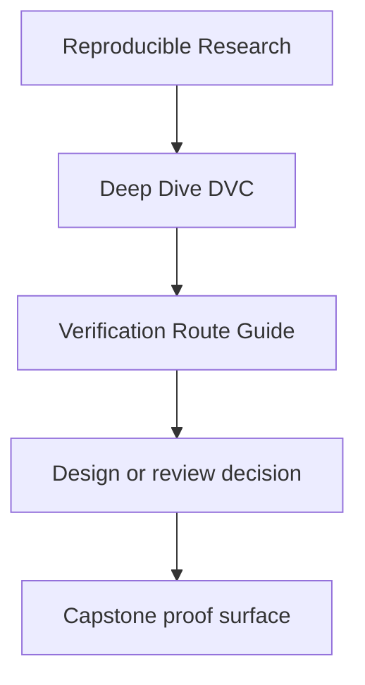
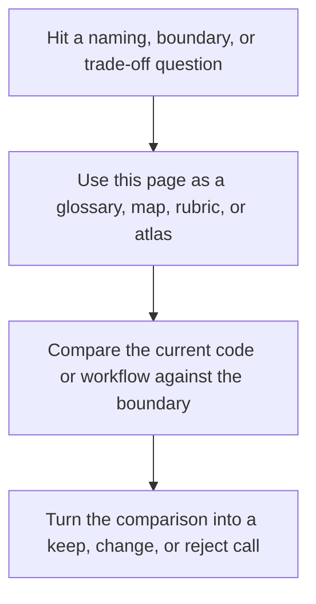

# Verification Route Guide

<!-- page-maps:start -->
## Reference Position

<!-- page-maps:end -->

Read the first diagram as a lookup map: this page is part of the review shelf, not a first-read narrative. Read the second diagram as the reference rhythm: arrive with a concrete ambiguity, compare the current work against the boundary on the page, then turn that comparison into a decision.

The DVC capstone has several proof commands, but they answer different questions. This
page makes the route explicit so learners do not mistake a reading bundle for an executed
proof or a recovery drill for the whole repository contract.

---

## Verification Routes

| Command | Use it when you want to know | What it gives you |
| --- | --- | --- |
| `make PROGRAM=reproducible-research/deep-dive-dvc capstone-tour` | what to read before trusting the repository | an executed learner-facing proof bundle |
| `make PROGRAM=reproducible-research/deep-dive-dvc capstone-repro` | whether the declared graph can execute | a fresh DVC pipeline run |
| `make PROGRAM=reproducible-research/deep-dive-dvc capstone-experiment-review` | whether a changed parameter set is comparable to the baseline | a focused experiment comparison bundle |
| `make PROGRAM=reproducible-research/deep-dive-dvc capstone-verify` | whether the current repository satisfies the promoted contract | pipeline execution plus contract validation |
| `make PROGRAM=reproducible-research/deep-dive-dvc capstone-verify-report` | whether you need durable verification evidence | a saved verification bundle |
| `make PROGRAM=reproducible-research/deep-dive-dvc capstone-release-review` | whether the promoted boundary is reviewable as a downstream contract | a focused release evidence bundle |
| `make PROGRAM=reproducible-research/deep-dive-dvc capstone-confirm` | whether the repository can defend itself as a whole | verification, tests, and recovery proof |
| `make -C capstone recovery-drill` | whether tracked state survives local loss | a restore-from-remote rehearsal |
| `make PROGRAM=reproducible-research/deep-dive-dvc capstone-recovery-review` | whether the restore evidence is durable enough for review | a recovery review bundle with before and after state |

[Back to top](#top)

---

## Best Route By Situation

| Situation | Best first command | Why |
| --- | --- | --- |
| I am new to the capstone | `make PROGRAM=reproducible-research/deep-dive-dvc capstone-tour` | it preserves repository reading order before the strongest proof route |
| I want to inspect the truthful DAG | `make PROGRAM=reproducible-research/deep-dive-dvc capstone-repro` | it focuses on execution and lock evidence |
| I want to compare an experiment candidate against the baseline | `make PROGRAM=reproducible-research/deep-dive-dvc capstone-experiment-review` | it isolates declared deviations and comparable metrics |
| I want to validate the promoted contract | `make PROGRAM=reproducible-research/deep-dive-dvc capstone-verify` | it connects execution to promoted evidence |
| I want to inspect the release boundary as a downstream reviewer | `make PROGRAM=reproducible-research/deep-dive-dvc capstone-release-review` | it narrows attention to promoted trust surfaces |
| I want the strongest built-in repository check | `make PROGRAM=reproducible-research/deep-dive-dvc capstone-confirm` | it combines verification, tests, and recovery |
| I want to test durability under loss | `make -C capstone recovery-drill` | it isolates the recovery claim |
| I want a reviewable recovery bundle after the drill | `make PROGRAM=reproducible-research/deep-dive-dvc capstone-recovery-review` | it packages the recovery evidence for later inspection |
| I want durable verification evidence | `make PROGRAM=reproducible-research/deep-dive-dvc capstone-verify-report` | it writes the main verification artifacts to one place |

[Back to top](#top)

---

## A Safe Learner Sequence

Use this order if you are unsure where to start:

1. `make PROGRAM=reproducible-research/deep-dive-dvc capstone-walkthrough`
2. read `capstone/README.md`
3. read `capstone/dvc.yaml` and `capstone/dvc.lock`
4. `make PROGRAM=reproducible-research/deep-dive-dvc capstone-verify`
5. `make PROGRAM=reproducible-research/deep-dive-dvc capstone-verify-report`
6. `make PROGRAM=reproducible-research/deep-dive-dvc capstone-release-review` when you want the downstream contract route
7. `make PROGRAM=reproducible-research/deep-dive-dvc capstone-confirm` when you want the strongest repository-wide proof route

This sequence moves from orientation to declaration, then to execution, then to promoted
contract, then to full repository confirmation.

[Back to top](#top)

---

## Common Route Mistakes

| Mistake | Why it slows the learner down |
| --- | --- |
| starting with `confirm` before reading the repository | the strongest proof route is not the best first teaching route |
| using `repro` when the question is downstream trust | execution alone does not validate the promoted contract |
| using `tour` as if it settles every trust question | the bundle is orientation and executed evidence, not every narrower review route |
| using `recovery-drill` as a general repository test | recovery answers a narrower durability question |
| using `verify` as if it explains experiment quality | publish verification is not experiment review |

[Back to top](#top)

---

## Best Companion Pages

The most useful companion pages for this guide are:

* [`command-guide.md`](../capstone/command-guide.md)
* [`practice-map.md`](practice-map.md)
* [`proof-matrix.md`](../guides/proof-matrix.md)
* [`capstone-map.md`](../capstone/capstone-map.md)

[Back to top](#top)
