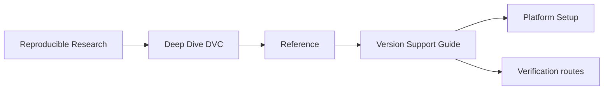
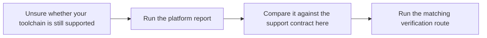

<a id="top"></a>

# Version Support Guide

<!-- page-maps:start -->
## Page Maps




<!-- page-maps:end -->

This guide makes the Deep Dive DVC support contract explicit. The course is not
supported against arbitrary local tools; it is supported against the capstone-managed
environment and the verification routes that prove it still behaves as expected.

---

## Supported Toolchain Contract

These are the supported boundaries for the course and capstone:

- Python 3.10 or newer, matching the floor declared in `capstone/pyproject.toml`
- Git available on the command line
- DVC installed inside the capstone-managed virtual environment through `make install`
- a writable local filesystem remote for `.dvc-remote/`

The support promise is tied to the capstone-managed environment, not to whichever
system-level `dvc` binary happens to be installed on the machine.

[Back to top](#top)

---

## Truth Sources For Version Discipline

Use these files and commands as the authoritative support surfaces:

| Surface | What it tells you |
| --- | --- |
| `capstone/pyproject.toml` | the supported Python floor for the packaged capstone |
| `capstone/Makefile` `install` target | how the supported environment is created and which tools are installed into it |
| `capstone/Makefile` `platform-report` target | the actual Python, Git, and DVC versions in the supported environment |
| `make verify` and proof routes | whether the current toolchain still honors the course contract in practice |

If one of these surfaces changes, this guide should change with it.

[Back to top](#top)

---

## How To Verify You Are Inside The Support Contract

From `programs/reproducible-research/deep-dive-dvc/capstone/` run:

```sh
make install
make platform-report
make verify
```

Interpret the result in this order:

1. `make install` creates the supported virtual environment and installs DVC there.
2. `make platform-report` tells you which Python, Git, and DVC versions are actually in play.
3. `make verify` proves the current toolchain can execute the repository’s supported verification route.

If `platform-report` looks plausible but `make verify` fails, you are still outside the
effective support contract until the verification route is green.

[Back to top](#top)

---

## Drift Signals

Treat these as signs that you need to re-check the support contract:

- Python upgraded locally and the capstone virtual environment was not recreated
- Git changed enough to alter repository or line-ending behavior
- DVC was installed or upgraded outside `make install`
- `make verify` or `make recovery-audit` starts failing after tool changes
- the course docs still mention a setup flow that no longer matches the capstone Makefile

[Back to top](#top)

---

## What This Guide Deliberately Does Not Promise

- It does not promise support for arbitrary system-wide DVC installs outside the capstone environment.
- It does not treat “the command exists” as enough; the verification route still decides whether the environment is trustworthy.
- It does not promise frozen behavior across every future DVC release without rerunning the course proof routes.

That restraint is intentional. Reproducibility training should be explicit about where
tool support stops and verification begins.

[Back to top](#top)
