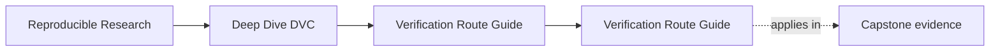
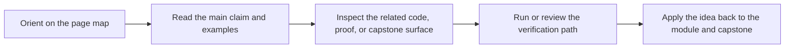

# Verification Route Guide

<!-- page-maps:start -->
## Page Maps

<!-- page-maps:end -->

The DVC capstone has several proof commands, but they answer different questions. This
page makes the route explicit so learners do not mistake a reading bundle for an executed
proof or a recovery drill for the whole repository contract.

---

## Verification Routes

| Command | Use it when you want to know | What it gives you |
| --- | --- | --- |
| `make -C capstone walkthrough` | what to read before running the workflow | a learner-first bundle with the contract, declaration, recorded lock state, and reading route |
| `make -C capstone repro` | whether the declared graph can execute | a fresh DVC pipeline run |
| `make -C capstone experiment-review` | whether a changed parameter set is comparable to the baseline | a focused experiment comparison bundle |
| `make -C capstone verify` | whether the current repository satisfies the promoted contract | pipeline execution plus contract validation |
| `make -C capstone release-review` | whether the promoted boundary is reviewable as a downstream contract | a focused release evidence bundle |
| `make -C capstone confirm` | whether the repository can defend itself as a whole | verification, tests, and recovery proof |
| `make -C capstone recovery-drill` | whether tracked state survives local loss | a restore-from-remote rehearsal |
| `make -C capstone recovery-review` | whether the restore evidence is durable enough for review | a recovery review bundle with before and after state |
| `make -C capstone tour` | what executed proof artifacts another learner should inspect | a learner-facing bundle of executed evidence |

[Back to top](#top)

---

## Best Route By Situation

| Situation | Best first command | Why |
| --- | --- | --- |
| I am new to the capstone | `make -C capstone walkthrough` | it preserves reading order before mechanics |
| I want to inspect the truthful DAG | `make -C capstone repro` | it focuses on execution and lock evidence |
| I want to compare an experiment candidate against the baseline | `make -C capstone experiment-review` | it isolates declared deviations and comparable metrics |
| I want to validate the promoted contract | `make -C capstone verify` | it connects execution to promoted evidence |
| I want to inspect the release boundary as a downstream reviewer | `make -C capstone release-review` | it narrows attention to promoted trust surfaces |
| I want the strongest built-in repository check | `make -C capstone confirm` | it combines verification, tests, and recovery |
| I want to test durability under loss | `make -C capstone recovery-drill` | it isolates the recovery claim |
| I want a reviewable recovery bundle after the drill | `make -C capstone recovery-review` | it packages the recovery evidence for later inspection |
| I want a bundle to review after execution | `make -C capstone tour` | it writes the main proof artifacts to one place |

[Back to top](#top)

---

## A Safe Learner Sequence

Use this order if you are unsure where to start:

1. `make PROGRAM=reproducible-research/deep-dive-dvc capstone-walkthrough`
2. read `capstone/README.md`
3. read `capstone/dvc.yaml` and `capstone/dvc.lock`
4. `make -C capstone verify`
5. `make -C capstone tour`
6. `make -C capstone release-review` when you want the downstream contract route
7. `make -C capstone confirm` when you want the strongest repository-wide proof route

This sequence moves from orientation to declaration, then to execution, then to promoted
contract, then to full repository confirmation.

[Back to top](#top)

---

## Common Route Mistakes

| Mistake | Why it slows the learner down |
| --- | --- |
| starting with `confirm` before reading the repository | the strongest proof route is not the best first teaching route |
| using `repro` when the question is downstream trust | execution alone does not validate the promoted contract |
| using `tour` as if it creates truth by itself | the bundle is evidence packaging, not the underlying proof |
| using `recovery-drill` as a general repository test | recovery answers a narrower durability question |
| using `verify` as if it explains experiment quality | publish verification is not experiment review |

[Back to top](#top)

---

## Best Companion Pages

The most useful companion pages for this guide are:

* [`command-guide.md`](command-guide.md)
* [`practice-map.md`](practice-map.md)
* [`proof-matrix.md`](proof-matrix.md)
* [`capstone-map.md`](capstone-map.md)

[Back to top](#top)
