<a id="top"></a>

# Deep Dive Make

A program guide and executable capstone that teaches **GNU Make as a build-graph engine**—not a scripting language. The goal is simple: help you write Makefiles that are **truthful, race-free under `-j`, deterministic, and self-tested**, from your first real Makefile to long-lived build-system stewardship.

[](https://github.com/bijux/bijux-masterclass/actions/workflows/program-validation.yml?query=branch%3Amaster)
[](https://www.gnu.org/software/make/)
[](https://github.com/bijux/bijux-masterclass/blob/master/LICENSE)
[](https://bijux.io/bijux-masterclass/reproducible-research/deep-dive-make/)
[](https://github.com/bijux/bijux-masterclass/tree/master/programs/reproducible-research/deep-dive-make/capstone)
> Validation runs from the monorepo root against the shared `program-validation.yml` workflow.
---

## What this is

Most Makefiles “work” until they don’t: hidden inputs, phony ordering, stamp hacks, and parallel builds that silently change behavior.

**Deep Dive Make** is a structured path out of that mess. It teaches Make through a strict contract:

- **Truthful DAG**: every dependency edge is explicit (depfiles, manifests, or principled stamps).
- **Atomic publication**: no partial artifacts, no half-written outputs.
- **Parallel safety**: `-j` speeds up builds without changing semantics.
- **Determinism**: serial and parallel builds converge to identical results.
- **Self-testing**: the build validates itself (convergence, equivalence, and failure modes).

This is a practical step toward *real* understanding of Make: what it guarantees, what it does not, and how to design Makefiles that remain correct as projects grow.

[Back to top](#top)

---

## What you get

### 1) The program guide (10 modules)

A compact, opinionated handbook with patterns, anti-patterns, exercises, and a real
beginner-to-mastery progression:

- **01 — Foundations**: targets, prerequisites, rebuild semantics, and the first trustworthy local builds.
- **02 — Scaling**: parallelism, ordering primitives, discovery patterns, and structure for growth.
- **03 — Production Practice**: determinism, CI discipline, invariants, and style constraints that prevent drift.
- **04 — Semantics Under Pressure**: edge cases and battle-tested rules you rely on when things break.
- **05 — Hardening**: portability, jobserver correctness, modeled inputs, performance, and failure isolation.
- **06 — Generated Files and Pipeline Boundaries**: code generators, manifests, and multi-output correctness.
- **07 — Reusable Build Architecture**: layered includes, macros, and public build APIs.
- **08 — Release Engineering**: packaging, publication, checksums, and install contracts.
- **09 — Performance and Incident Response**: measurement, observability, and build runbooks.
- **10 — Mastery**: migration strategy, governance, anti-patterns, and tool-boundary judgment.

Read on the website: https://bijux.io/bijux-masterclass/reproducible-research/deep-dive-make/

### 2) The executable capstone

`capstone/` is a working build that embodies the rules above and provides a concrete reference for “what correct looks like” under pressure (including parallel builds).

### 3) A repro pack of failure modes

Small, isolated examples of common pitfalls (races, stamp lies, mkdir hazards, generated header modeling) meant to be *reproduced*, not merely described.

[Back to top](#top)

---

## Quick start
From the monorepo root:

### Linux (GNU Make)

```sh
make PROGRAM=reproducible-research/deep-dive-make test
make PROGRAM=reproducible-research/deep-dive-make capstone-tour
```

### macOS (GNU Make via Homebrew)

```sh
brew install make
make PROGRAM=reproducible-research/deep-dive-make test
make PROGRAM=reproducible-research/deep-dive-make capstone-tour
```

If `selftest` passes, you’ve validated the capstone’s contract on your machine.

[Back to top](#top)

---

## Repository layout

```mermaid
graph TD
  root["bijux-masterclass/programs/reproducible-research/deep-dive-make/"]
  root --> book["course-book/"]
  root --> capstone["capstone/"]
  root --> workflows["../../../../.github/workflows/"]
  root --> license["LICENSE"]
  root --> readme["README.md"]
  book --> m00["module-00.md"]
  book --> m01["module-01.md"]
  book --> m02["module-02.md"]
  book --> m03["module-03.md"]
  book --> m04["module-04.md"]
  book --> m05["module-05.md"]
  book --> m06["module-06.md"]
  book --> m07["module-07.md"]
  book --> m08["module-08.md"]
  book --> m09["module-09.md"]
  book --> m10["module-10.md"]
  capstone --> capMakefile["Makefile"]
  capstone --> mk["mk/"]
  capstone --> src["src/"]
  capstone --> include["include/"]
  capstone --> scripts["scripts/"]
  capstone --> tests["tests/"]
  capstone --> repro["repro/"]
  workflows --> ci["program-validation.yml"]
```



[Back to top](#top)

---

## Who this is for

* Engineers learning Make for the first time and wanting a correctness-first path.
* Engineers inheriting brittle Makefiles and needing a safe migration path.
* People who “know Make” but still get surprised by rebuild behavior or `-j` races.
* Teams that want a build system they can trust in CI and at scale.

This is not “Make syntax tutorials.” It is **build semantics and correctness engineering** with Make as the tool.

[Back to top](#top)

---

## Contributing

Contributions that improve correctness, clarity, or reproducibility are welcome (typos, exercises, minimal repros, capstone hardening).

1. Fork & clone `bijux-masterclass`
2. Make a focused change (docs or capstone)
3. From the monorepo root, verify:
   ```sh
   make PROGRAM=reproducible-research/deep-dive-make test
   ```
4. Open a PR against `master` or `main`

[Back to top](#top)

---

## License

MIT — see the repository root [LICENSE](https://github.com/bijux/bijux-masterclass/blob/master/LICENSE). © 2025 Bijan Mousavi <bijan@bijux.io>.

[Back to top](#top)
