<a id="top"></a>

# Deep Dive Make

A program guide and executable capstone that teaches **GNU Make as a build-graph engine**—not a scripting language. The goal is simple: help you write Makefiles that are **truthful, race-free under `-j`, deterministic, and self-tested**, from your first real Makefile to long-lived build-system stewardship.

> Validation runs from the monorepo root against the shared `program-validation.yml` workflow.
---

## What this is

Most Makefiles “work” until they don’t: hidden inputs, phony ordering, stamp hacks, and parallel builds that silently change behavior.

**Deep Dive Make** is a structured path out of that mess. It teaches Make through a strict contract:

- **Truthful DAG**: every dependency edge is explicit (depfiles, manifests, or principled stamps).
- **Atomic publication**: no partial artifacts, no half-written outputs.
- **Parallel safety**: `-j` speeds up builds without changing semantics.
- **Determinism**: serial and parallel builds converge to identical results.
- **Self-testing**: the build validates itself (convergence, equivalence, and failure modes).

This is a practical step toward *real* understanding of Make: what it guarantees, what it does not, and how to design Makefiles that remain correct as projects grow.

The course-book now has three stable surfaces:

- `course-book/guides/` for learner routes, module promises, checkpoints, and capstone entry
- `course-book/reference/` for durable review maps, glossaries, standards, and anti-patterns
- `course-book/module-00-orientation/` plus Modules `01` to `10` for the core teaching arc

Use the course in this order:

1. `course-book/guides/start-here.md`
2. `course-book/guides/pressure-routes.md`
3. `course-book/guides/course-guide.md`
4. `course-book/guides/module-promise-map.md`
5. `course-book/guides/module-checkpoints.md`
6. `course-book/module-00-orientation/index.md`
7. Modules `01` to `10` in order
8. `course-book/guides/proof-ladder.md` and `course-book/guides/capstone-map.md` once the local model is clear

## Module map

| Module | Title | Main focus |
| --- | --- | --- |
| `00` | Orientation and Study Practice | establish the learner route, proof ladder, and capstone timing |
| `01` | Build Graph Truth and Rebuild Semantics | make dependency edges and rebuild meaning explicit |
| `02` | Parallel Safety and Project Structure | scale the graph without introducing race-prone structure |
| `03` | Determinism, Debugging, and CI Proof | make builds explainable, repeatable, and self-testing |
| `04` | CLI Semantics, Precedence, and Rule Edge Cases | survive pressure with a correct mental model of Make behavior |
| `05` | Portability, Jobserver, and Failure Modes | harden builds across environments and concurrency settings |
| `06` | Generated Files, Multi-Output Rules, and Pipeline Boundaries | model generators and publication boundaries truthfully |
| `07` | Reusable Build Architecture and Public Build APIs | turn Make into a governable repository architecture |
| `08` | Release Engineering and Artifact Publication Contracts | publish artifacts with explicit install and integrity rules |
| `09` | Performance, Observability, and Incident Response | diagnose build incidents with evidence rather than folklore |
| `10` | Migration, Governance, and Make Boundaries | finish with stewardship, migration, and tool-boundary judgment |

[Back to top](#top)

---

## What you get

### 1) The program guide (10 modules)

A compact, opinionated handbook with patterns, anti-patterns, exercises, and a real
beginner-to-mastery progression. The module map above is the stable table of contents:
each module title is short enough to scan, specific enough to guide review, and aligned
to one shared naming style across the course-book surfaces.

Read on the website: https://bijux.io/bijux-masterclass/reproducible-research/deep-dive-make/

### 2) The executable capstone

`capstone/` is a working build that embodies the rules above and provides a concrete reference for “what correct looks like” under pressure (including parallel builds).

### 3) Review surfaces that keep the course honest

The course now includes dedicated support pages for:

- topic boundaries and blind spots
- module promise tracking
- module-end checkpoints
- anti-pattern routing
- proof sizing and capstone escalation

### 4) A repro pack of failure modes

Small, isolated examples of common pitfalls (races, stamp lies, mkdir hazards, generated header modeling) meant to be *reproduced*, not merely described.

[Back to top](#top)

---

## Quick start
From the monorepo root:

### Linux (GNU Make)

```sh
make PROGRAM=reproducible-research/deep-dive-make capstone-walkthrough
make PROGRAM=reproducible-research/deep-dive-make inspect
make PROGRAM=reproducible-research/deep-dive-make test
make PROGRAM=reproducible-research/deep-dive-make proof
```

### macOS (GNU Make via Homebrew)

```sh
brew install make
make PROGRAM=reproducible-research/deep-dive-make capstone-walkthrough
make PROGRAM=reproducible-research/deep-dive-make inspect
make PROGRAM=reproducible-research/deep-dive-make test
make PROGRAM=reproducible-research/deep-dive-make proof
```

Use `capstone-walkthrough` first, `inspect` when you need the public boundary, `test`
for routine proof, and `proof` only when the narrower routes are no longer enough.

[Back to top](#top)

---

## Repository layout

```mermaid
graph TD
  root["bijux-masterclass/programs/reproducible-research/deep-dive-make/"]
  root --> book["course-book/"]
  root --> capstone["capstone/"]
  root --> workflows["../../../../.github/workflows/"]
  root --> license["LICENSE"]
  root --> readme["README.md"]
  book --> m00["module-00-orientation/index.md"]
  book --> m01["module-01-build-graph-foundations-truth/index.md"]
  book --> m02["module-02-parallel-safety-project-structure/index.md"]
  book --> m03["module-03-determinism-debugging-self-testing/index.md"]
  book --> m04["module-04-rule-semantics-precedence-edge-cases/index.md"]
  book --> m05["module-05-portability-hermeticity-failure-modes/index.md"]
  book --> m06["module-06-generated-files-multi-output-pipeline-boundaries/index.md"]
  book --> m07["module-07-build-architecture-layered-includes-apis/index.md"]
  book --> m08["module-08-release-engineering-artifact-contracts/index.md"]
  book --> m09["module-09-performance-observability-incident-response/index.md"]
  book --> m10["module-10-migration-governance-tool-boundaries/index.md"]
  capstone --> capMakefile["Makefile"]
  capstone --> mk["mk/"]
  capstone --> src["src/"]
  capstone --> include["include/"]
  capstone --> scripts["scripts/"]
  capstone --> tests["tests/"]
  capstone --> repro["repro/"]
  workflows --> ci["program-validation.yml"]
```



[Back to top](#top)

---

## Who this is for

* Engineers learning Make for the first time and wanting a correctness-first path.
* Engineers inheriting brittle Makefiles and needing a safe migration path.
* People who “know Make” but still get surprised by rebuild behavior or `-j` races.
* Teams that want a build system they can trust in CI and at scale.

This is not “Make syntax tutorials.” It is **build semantics and correctness engineering** with Make as the tool.

[Back to top](#top)

---

## Contributing

Contributions that improve correctness, clarity, or reproducibility are welcome (typos, exercises, minimal repros, capstone hardening).

1. Fork & clone `bijux-masterclass`
2. Make a focused change (docs or capstone)
3. From the monorepo root, verify:
   ```sh
   make PROGRAM=reproducible-research/deep-dive-make test
   ```
4. Open a PR against `master` or `main`

[Back to top](#top)

---

## License

MIT — see the repository root [LICENSE](https://github.com/bijux/bijux-masterclass/blob/master/LICENSE). © 2025 Bijan Mousavi <bijan@bijux.io>.

[Back to top](#top)
