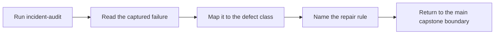

# Incident Review Guide

<!-- page-maps:start -->
## Guide Maps

<!-- page-maps:end -->

Use this guide when you want one executed failure bundle instead of a list of repro file
names. The point is to study a defect class with evidence, not to admire a broken
Makefile in isolation.

---

## Reading Order

Read an incident bundle in this order:

1. `route.txt`
2. `README.md`
3. `repro-case.mk`
4. `command.txt`
5. `output.txt`
6. `summary.txt`
7. `PROOF_GUIDE.md`
8. `review-questions.txt`

That route keeps the failure specimen ahead of the explanation, so you do not mistake
the summary for the evidence.

[Back to top](#top)

---

## What Each Surface Gives You

| File | Why it exists |
| --- | --- |
| `repro-case.mk` | the smallest preserved defect specimen |
| `command.txt` | the exact command used to reproduce the incident |
| `output.txt` | the concrete failure output or race symptom |
| `summary.txt` | the named defect class and the repair lesson |
| `PROOF_GUIDE.md` | the matching proof route in the real capstone |
| `review-questions.txt` | prompts that force a learner to name cause and repair |

[Back to top](#top)

---

## What A Good Incident Review Should Answer

By the end of one incident review, you should be able to say:

* which output or edge was modeled dishonestly
* whether the failure depends on `-j` or is visible in serial mode
* which repair belongs in the main capstone rather than in the repro itself
* which target in the real capstone would prove the repaired property

[Back to top](#top)

---

## Best Incident Sequence

If you are new to the repro pack, use this order:

1. shared mutable output
2. directory creation race
3. order-only misuse
4. generated-header modeling

That sequence moves from visibly broken outcomes to more subtle graph lies.

[Back to top](#top)

---

## Companion Surfaces

Use these when the incident bundle raises a bigger question:

* `REPRO_GUIDE.md` for the broader failure-class catalog
* `PROOF_GUIDE.md` for the corresponding production proof routes
* `ARCHITECTURE.md` when the repair depends on ownership boundaries

[Back to top](#top)
