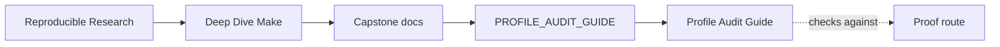
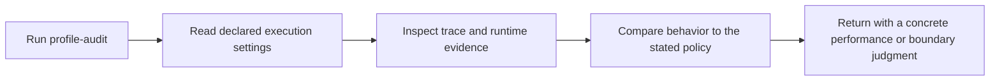

# Profile Audit Guide

<!-- page-maps:start -->
## Guide Maps

<!-- page-maps:end -->

Use this guide when the question is about execution policy: trace volume, runtime knobs,
tool boundaries, or whether the capstone keeps observability and throughput concerns
explicit instead of accidental.

---

## Reading Order

Read the profile audit bundle in this order:

1. `route.txt`
2. `README.md`
3. `summary.txt`
4. `settings.env`
5. `trace-count.txt`
6. `help.txt`
7. `PROOF_GUIDE.md`
8. `review-questions.txt`

That route keeps declared boundary first, measured evidence second, and interpretation
third.

[Back to top](#top)

---

## What Each File Tells You

| File | Review purpose |
| --- | --- |
| `summary.txt` | shortest description of the audit result |
| `settings.env` | make binary, shell, and guardrail settings used for the run |
| `trace-count.txt` | whether observability cost stayed within the declared heuristic |
| `help.txt` | which targets and variables are exposed publicly |
| `PROOF_GUIDE.md` | how the profile audit fits into the wider proof surface |
| `review-questions.txt` | prompts that force you to make an operational judgment |

[Back to top](#top)

---

## What The Audit Should Help You Decide

By the end of the profile audit, you should be able to answer:

* whether the capstone declares its execution boundary clearly enough for another machine
* whether trace volume is still a deliberate teaching guardrail instead of drift
* whether a performance question belongs in the build graph, the harness, or a release path
* whether the course is presenting execution policy as a first-class design concern

[Back to top](#top)

---

## Common Review Mistakes

Avoid these:

* treating `trace-count` as a benchmark instead of a guardrail
* assuming portability questions can be answered from output files alone
* treating profile review as separate from proof or contract review
* ignoring `settings.env` and then reasoning from the wrong make binary or shell

[Back to top](#top)

---

## Best Companion Guides

Use these with the profile audit:

* `PROOF_GUIDE.md`
* `SELFTEST_GUIDE.md`
* `TARGET_GUIDE.md`
* `CONTRACT_AUDIT_GUIDE.md`

[Back to top](#top)
