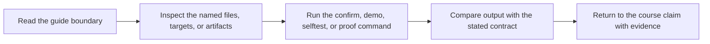

# Proof Guide

<!-- page-maps:start -->
## Guide Maps

<!-- page-maps:end -->

This capstone is designed to prove build-system properties, not just compile a small C
program. Use this guide when you want the shortest route from a claim to the target, file,
or failure surface that defends it.

---

## Claims And Their First Evidence

| Claim | First target | First files to inspect |
| --- | --- | --- |
| the graph is truthful and reaches a stable state | `make selftest` | `Makefile`, `tests/run.sh` |
| serial and parallel schedules mean the same thing | `make selftest` | `tests/run.sh`, `mk/objects.mk`, `mk/stamps.mk` |
| generated files are modeled as real edges | `make dyn` | `scripts/gen_dynamic_h.py`, `Makefile`, `repro/04-generated-header.mk` |
| artifact publication is atomic | `make all` | `Makefile`, `mk/macros.mk` |
| deterministic discovery is rooted and reviewable | `make discovery-audit` | `Makefile`, `mk/objects.mk` |
| the build boundary is portable enough to be explicit | `make portability-audit` | `Makefile`, `mk/contract.mk` |
| failure classes are teachable instead of folklore | `make repro` | `repro/`, `REPRO_GUIDE.md` |

[Back to top](#top)

---

## Best Reading Order

Use this order the first time:

1. `README.md` for the repository contract
2. `Makefile` for the public interface
3. `tests/run.sh` for the proof harness
4. `mk/contract.mk` for platform and policy boundaries
5. `mk/objects.mk` and `mk/stamps.mk` for graph truth
6. `REPRO_GUIDE.md` and `repro/` for failure teaching surfaces

That route keeps contract and proof ahead of implementation detail.

[Back to top](#top)

---

## Best Targets By Question

| Question | First target | Why |
| --- | --- | --- |
| does the build still tell the truth after a successful run | `make selftest` | it checks convergence and negative hidden-input behavior |
| which parts of the build are safe under `-j` | `make selftest` | it compares serial and parallel artifact hashes |
| what is publicly supported for learners and reviewers | `make help` | it exposes the stable command surface |
| where do the common defects live in miniature form | `make repro` | it lists the curated failure pack |
| what assumptions does this capstone make about platform and tools | `make portability-audit` | it prints the declared execution boundary |

[Back to top](#top)

---

## Companion Surfaces

Use these files together:

* `README.md` for the repository contract
* `REPRO_GUIDE.md` for the failure-class route
* `tests/run.sh` for the strongest proof path
* `mk/contract.mk` for boundary declarations
* `mk/common.mk` and `mk/macros.mk` for reusable build mechanics

[Back to top](#top)
