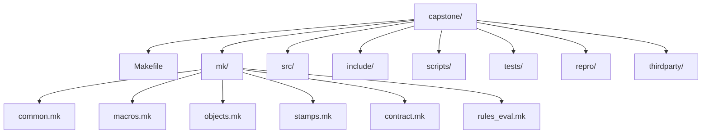

<a id="top"></a>
# Deep Dive Make: Program Capstone
The capstone is the executable reference build for **Deep Dive Make**: a compact C project whose Makefiles are written to **prove**, not merely claim, production-grade properties—**truthful DAGs, atomic publication, parallel safety, determinism, and self-testing invariants**. It is the practical companion to the program guide in [`course-book/`](https://github.com/bijux/bijux-masterclass/tree/master/programs/reproducible-research/deep-dive-make/course-book): every major pattern in the text has a living implementation here, with repros for common failure modes and CI-enforced verification.

[](https://github.com/bijux/bijux-masterclass/actions/workflows/program-validation.yml?query=branch%3Amaster)
[](https://www.gnu.org/software/make/)
[](https://github.com/bijux/bijux-masterclass/blob/master/LICENSE)
[](https://bijux.io/bijux-masterclass/reproducible-research/deep-dive-make/)
[](https://github.com/bijux/bijux-masterclass/tree/master/programs/reproducible-research/deep-dive-make/capstone)

> **In one line:** a small build that behaves like a serious build—correct under change, correct under `-j`, and instrumented to catch its own lies.

---
## Table of Contents
- [Purpose](#purpose)
- [Quick start](#quick-start)
- [Public targets](#public-targets)
- [What it builds](#what-it-builds)
- [Where it fits in the program](#where-it-fits-in-the-program)
- [Architecture](#architecture)
- [Platform notes](#platform-notes)
- [Repro pack](#repro-pack)
- [Links into the program guide](#links-into-the-program-guide)
- [Contributing](#contributing)
- [License](#license)
---
## Purpose
This capstone exists to eliminate ambiguity. “Correct Makefiles” should not be a matter of taste; they should be a matter of **verifiable properties**.
This build is designed to enforce:  
- **Truthful DAG**: edges are explicit (depfiles, manifests/stamps where required), with deterministic discovery.  
- **Atomic publication**: outputs are not visible until they are valid.  
- **Parallel safety**: `-j` accelerates execution but does not alter meaning.  
- **Determinism**: serial and parallel runs converge to identical outputs.  
- **Self-tests**: the build system is treated as code—tested, gated, and regression-resistant.    
[Back to top](#top)

---
## Quick start
From this directory (`capstone/`):
```sh
# Linux (GNU Make)
make selftest
```
```sh
# macOS (install GNU Make first, then use gmake)
brew install make
gmake selftest
```
A passing `selftest` is the signal that the contract holds: convergence, serial/parallel equivalence, and negative tests designed to detect common defects.
[Back to top](#top)

---
## Public targets
These are the stable entrypoints you can rely on and extend:

| Target | Meaning | Why you care |
| ------------------- | --------------------------------------------------------------------- | ------------------------------------ |
| `help` | Print available targets and key knobs. | Discoverability. |
| `all` | Build primary artifacts. | Normal build. |
| `test` | Run runtime checks on outputs. | Functional validation. |
| `selftest` | Verify build-system invariants (convergence, equivalence, negatives). | Integrity gate. |
| `discovery-audit` | Confirm discovery is rooted and stable. | Prevent “works on my machine” edges. |
| `attest` | Record toolchain/flag/env facts (non-contaminating by default). | Reproducibility audit. |
| `portability-audit` | Check version/tool assumptions and feature availability. | Cross-platform discipline. |
| `repro` | List available failure repros. | Training + debugging. |
| `clean` | Remove build outputs and stamps. | Reset. |

Optional (explicit opt-in): `USE_EVAL=yes eval-demo` demonstrates quarantined `$(eval)` patterns.  
[Back to top](#top)

---
## What it builds
A deliberately small C project with real build-system pressure points:
* **`app`**: main executable built from a small set of sources.
* **Dynamic binaries**: `src/dynamic/*.c` discovered deterministically and built into `build/bin/dyn*`.
* **Generated header**: `build/include/dynamic.h` generated by `scripts/` and used across translation units.
Core mechanics:
* depfiles (`*.d`) are treated as true edges
* publication is atomic (temp → rename)
* tests assert behavior (not just “it compiled”)  
[Back to top](#top)

---
## Where it fits in the program
The capstone is intentionally strongest after the beginner modules have already taught the
core semantics on smaller local projects.

| Program area | What the capstone lets you verify |
| --- | --- |
| Modules 01-02 | The difference between a truthful graph and a graph that only appears to work. |
| Modules 03-05 | Deterministic discovery, selftests, portability boundaries, and failure-mode evidence. |
| Modules 06-07 | Generated headers, layered `mk/*.mk` architecture, and reusable build helpers. |
| Modules 08-09 | Dist packaging, attestations, performance guardrails, and incident-oriented diagnostics. |
| Module 10 | A compact system you can review for migration boundaries, governance rules, and anti-patterns. |

If you are new to Make, use this repository as corroboration after the early local
exercises, not as your first exposure to syntax.
[Back to top](#top)

---
## Architecture
The Makefiles are intentionally layered so the design stays readable under growth:

The intent is to model a “real” build in miniature: the same failure modes show up, but the surface area stays small enough to audit.  
[Back to top](#top)

---
## Platform notes
* **macOS**: `/usr/bin/make` is BSD Make—use GNU Make (`gmake`).
* **Toolchains differ**: determinism is verified via stamps/equivalence checks rather than assumed.
* **Portability**: the build declares its boundary (GNU Make floor, shell assumptions) and audits it with `portability-audit`.  
[Back to top](#top)

---
## Repro pack
`repro/` contains small Makefiles that intentionally demonstrate failure modes (often only visible under `-j`), along with the repair patterns taught in the program guide.
Examples include:
* shared append/log races
* temp file collisions and partial writes
* incorrect stamp usage that hides inputs
* incorrect modeling of generated headers
* directory creation hazards
Run a repro directly:
```sh
make -f repro/01-shared-append.mk -j4
```  

[Back to top](#top)

---
## Links into the program guide
* Program site: [https://bijux.io/bijux-masterclass/reproducible-research/deep-dive-make/](https://bijux.io/bijux-masterclass/reproducible-research/deep-dive-make/)
* Source chapters: [`course-book/`](https://github.com/bijux/bijux-masterclass/tree/master/programs/reproducible-research/deep-dive-make/course-book)
The capstone is referenced throughout the modules via “tie-ins.” The expectation is a tight loop:
**read → reproduce → repair → verify**  
[Back to top](#top)

---
## Contributing
Contributions are welcome when they improve **correctness**, **clarity**, or **reproducibility** (new repros, sharper invariants, better diagnostics).
Minimum bar for changes that touch the build (from repository root):
```sh
make PROGRAM=reproducible-research/deep-dive-make test
```
(or `gmake PROGRAM=reproducible-research/deep-dive-make test` on macOS)
Open a PR against `main` with a short “claim → proof” note (what you changed, why it’s correct, and how it’s verified).  
[Back to top](#top)

---
## License
MIT — see the repository root [`LICENSE`](https://github.com/bijux/bijux-masterclass/blob/master/LICENSE). © 2025 Bijan Mousavi <bijan@bijux.io>.  
[Back to top](#top)
