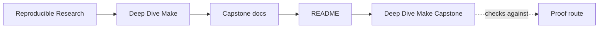
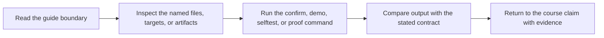
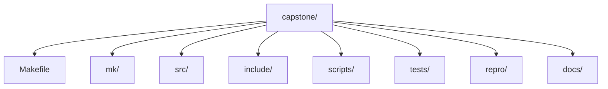

# Deep Dive Make Capstone

<!-- page-maps:start -->
## Guide Maps




<!-- page-maps:end -->

Read the first diagram as the capstone shape. Read the second diagram as the entry rule:
choose the smallest route that answers the current question, then escalate only when the
question changes.

This capstone is the executable reference build for Deep Dive Make. It is a compact C
project used to corroborate the course's main claims about truthful graphs, atomic
publication, parallel safety, determinism, and self-testing. It is not meant to be a
first-contact playground for Make syntax.

## Use this capstone when

- the module idea is already legible and you want executable corroboration
- you need one repository that keeps graph truth, publication, and proof visible together
- you are reviewing whether a small build behaves like a serious build under pressure

## Do not use this capstone when

- you still need first exposure to the concept itself
- you want to browse the whole repository before choosing a question
- the strongest proof route feels safer than naming the current claim

## Choose the entry route by question

| If the question is... | Start here | Escalate only if needed |
| --- | --- | --- |
| what does this repository promise | `make walkthrough` | `make inspect` |
| which targets are public and what they mean | `make inspect` | `make contract-audit` |
| does the build prove convergence and parallel safety | `make selftest` | `make verify-report` |
| which failure class does this repro teach | `make incident-audit` | `make proof` |
| should I trust this as a stewardship specimen | `make proof` | `make confirm` |

From the repository root, the matching course-level commands are:

```sh
make PROGRAM=reproducible-research/deep-dive-make capstone-walkthrough
make PROGRAM=reproducible-research/deep-dive-make inspect
make PROGRAM=reproducible-research/deep-dive-make proof
```

Inside `capstone/`, use `gmake` on macOS because `/usr/bin/make` is BSD Make.

## First honest pass

1. Run `make walkthrough`.
2. Read [INDEX.md](docs/index.md).
3. Read [WALKTHROUGH_GUIDE.md](docs/walkthrough-guide.md).
4. Run `make inspect`.
5. Read [TARGET_GUIDE.md](docs/target-guide.md).
6. Run `make selftest`.
7. Read [PROOF_GUIDE.md](docs/proof-guide.md).

Stop there first. That is enough to see the public contract, the proof harness, and one
bounded review route without turning the capstone into a browsing exercise.

## What the main targets prove

| Target | What it proves | Why it matters |
| --- | --- | --- |
| `walkthrough` | the learner-facing reading order is bounded and explicit | first capstone contact stays humane |
| `inspect` | the public build contract is visible without the full proof route | review starts from stable surfaces |
| `selftest` | convergence, serial/parallel equivalence, and negative hidden-input detection | the build system is tested as a system |
| `verify-report` | the selftest evidence is saved as a review bundle | proof can be inspected later |
| `proof` | the sanctioned review bundle set exists and agrees with the contract | stewardship has a durable route |
| `confirm` | the strongest built-in confirmation path still passes | final review is stronger than first-pass learning |

## Repository shape



Use these areas deliberately:

- `Makefile` for public targets and entrypoints
- `mk/` for layered build responsibilities
- `scripts/` for generator and packaging boundaries
- `tests/` for build-system proof
- `repro/` for controlled failure teaching material
- `docs/` for bounded review routes

## Capstone docs

All capstone documentation lives under `docs/`:

- [ARCHITECTURE.md](docs/architecture.md)
- [CONTRACT_AUDIT_GUIDE.md](docs/contract-audit-guide.md)
- [INCIDENT_REVIEW_GUIDE.md](docs/incident-review-guide.md)
- [INDEX.md](docs/index.md)
- [PROFILE_AUDIT_GUIDE.md](docs/profile-audit-guide.md)
- [PROOF_GUIDE.md](docs/proof-guide.md)
- [REPRO_GUIDE.md](docs/repro-guide.md)
- [SELFTEST_GUIDE.md](docs/selftest-guide.md)
- [TARGET_GUIDE.md](docs/target-guide.md)
- [WALKTHROUGH_GUIDE.md](docs/walkthrough-guide.md)

## Good stopping point

Stop when you can name:

- the current claim
- the smallest route that proves it
- the next stronger route only if the current one stops being enough
