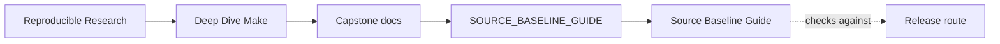
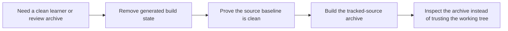

<a id="top"></a>

# Source Baseline Guide


<!-- page-maps:start -->
## Guide Maps




<!-- page-maps:end -->

Use this guide when you need to package the capstone as source instead of shipping
whatever build outputs happen to be in the working tree.

## What must stay out of a source archive

This capstone intentionally generates local build state while you work:

- `build/` and `stamps/` hold derived compilation and stamp outputs
- `app`, `all`, and `dist.tar.gz` are generated deliverables, not source inputs
- temporary files such as `*.tmp`, `*.tmp.*`, and `*.d.tmp` are local residue

Those files are useful when you are building or debugging. They are not part of the
clean source baseline another learner should inspect first.

## Source baseline workflow

Run these commands from the capstone directory:

```bash
gmake clean
gmake source-baseline-check
gmake source-bundle
```

The steps do different jobs:

- `gmake clean` removes generated build state
- `gmake source-baseline-check` proves the tree no longer carries local build residue
- `gmake source-bundle` writes a tracked-source archive from `git ls-files`

## What the source bundle includes

The source bundle includes tracked capstone files such as:

- the Makefiles and `mk/` policy surface
- docs such as `README.md`, `TARGET_GUIDE.md`, and `PROOF_GUIDE.md`
- source under `src/`, headers under `include/`, tests, and repro cases
- helper scripts used to build or package the capstone

## What the source bundle excludes

The source bundle excludes:

- generated build outputs
- temporary files from failed or partial publishes
- any other untracked or ignored working-tree state

## Best companion pages

- `README.md`
- `TARGET_GUIDE.md`
- `PROOF_GUIDE.md`
- `course-book/module-04-rule-semantics-precedence-edge-cases/index.md`

[Back to top](#top)
