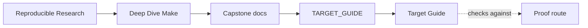
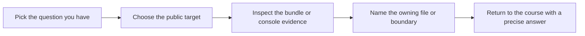

# Target Guide

<!-- page-maps:start -->
## Guide Maps

<!-- page-maps:end -->

Use this guide when `make help` shows many names but you still need to know which target
matches your question. The goal is not target memorization. The goal is choosing the
smallest honest command.

---

## Stable Review Targets

| Target | What it produces | Use when |
| --- | --- | --- |
| `help` | public target list and key variables | you are orienting yourself |
| `all` | main build outputs and convergence sentinel | you need the ordinary build result |
| `test` | runtime behavior checks | you need product-facing validation |
| `selftest` | convergence, schedule equivalence, and negative hidden-input checks | you need build-system proof |
| `walkthrough` | learner-first walkthrough bundle | you need a bounded first pass |
| `tour` | printed review route and focused follow-up surfaces | you need the shortest review entrypoint |
| `contract-audit` | public-contract review bundle | you need boundary and API review |
| `incident-audit` | executed failure review bundle | you need one defect class with evidence |
| `profile-audit` | execution-profile review bundle | you need policy and performance boundaries |
| `selftest-report` | saved selftest evidence bundle | you need durable proof output |
| `proof` | bundled learner-facing proof route | you need the sanctioned multi-bundle review path |
| `hardened` | strongest built-in validation set | you need confirmation before deeper changes |

[Back to top](#top)

---

## Fast Target Selection

### If the question is "what does this build promise?"

Use:

* `make help`
* `make contract-audit`

### If the question is "is the graph still honest?"

Use:

* `make selftest`
* `make selftest-report`

### If the question is "how should I enter the capstone?"

Use:

* `make walkthrough`
* `make tour`

### If the question is "which failure class does this teach?"

Use:

* `make repro`
* `make incident-audit`

### If the question is "what is the smallest honest proof?"

Use:

* `make walkthrough` for first repository contact
* `make inspect` for public-boundary review
* `make selftest` for build-contract proof
* `make proof` only when the narrower bundles are no longer enough

[Back to top](#top)

---

## Important Distinctions

Do not confuse these pairs:

* `all` versus `selftest`
  `all` builds artifacts once. `selftest` proves the build contract.
* `tour` versus `walkthrough`
  `tour` is the shortest review route. `walkthrough` writes the bounded first-pass bundle.
* `selftest-report` versus `proof`
  `selftest-report` saves one proof bundle. `proof` writes the sanctioned multi-bundle set.
* `contract-audit` versus `profile-audit`
  contract review is about public promises and boundary declarations; profile review is
  about execution-policy and observability assumptions.
* `selftest` versus `confirm`
  `selftest` proves the build contract. `confirm` performs the strongest shared stewardship pass.

[Back to top](#top)

---

## Best Companion Guides

Use these with the target guide:

* `PROOF_GUIDE.md`
* `ARCHITECTURE.md`
* `SELFTEST_GUIDE.md`
* `CONTRACT_AUDIT_GUIDE.md`
* `INCIDENT_REVIEW_GUIDE.md`
* `PROFILE_AUDIT_GUIDE.md`

[Back to top](#top)
