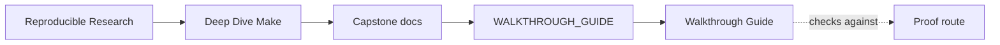
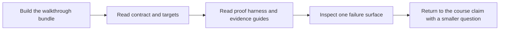

# Walkthrough Guide

<!-- page-maps:start -->
## Guide Maps

<!-- page-maps:end -->

Use this guide when you want the shortest sane first pass through the capstone. It is
for learners who need a deliberate reading order, not a directory listing.

---

## Recommended First Route

1. Run `make walkthrough`.
2. Read `README.md` for the capstone role in the program.
3. Read `TARGET_GUIDE.md` for the stable public targets.
4. Read `PROOF_GUIDE.md` for claim-to-evidence routing.
5. Read `tests/run.sh` to see what the proof harness actually checks.
6. Read `ARCHITECTURE.md` to place the `mk/*.mk` files and scripts in one system.
7. Inspect `repro/01-shared-log.mk` or `repro/05-mkdir-race.mk` for one failure class in miniature.

That route keeps contract first, proof second, ownership third, and failure teaching
fourth.

[Back to top](#top)

---

## Bundle Reading Order

When you are already in the generated walkthrough bundle, use this order:

1. `route.txt`
2. `README.md`
3. `PROOF_GUIDE.md`
4. `tests/run.sh`
5. `mk/contract.mk`
6. `mk/objects.mk`
7. `mk/stamps.mk`
8. `repro/01-shared-log.mk`

The walkthrough bundle is not meant to replace code review. It exists to keep the first
review pass bounded and human-readable.

[Back to top](#top)

---

## Time-Boxed Routes

### 20-minute route

* `README.md`
* `TARGET_GUIDE.md`
* `PROOF_GUIDE.md`
* `tests/run.sh`

Goal: know what the capstone promises and how it proves it.

### 45-minute route

* 20-minute route
* `ARCHITECTURE.md`
* `mk/objects.mk`
* `mk/stamps.mk`

Goal: know how graph truth is modeled.

### 75-minute route

* 45-minute route
* `REPRO_GUIDE.md`
* one file under `repro/`
* one audit guide matching your question

Goal: connect proof and failure teaching without random browsing.

[Back to top](#top)

---

## Questions To Carry

Keep asking these while you walk the capstone:

* which target is public and which is only implementation detail
* which file is naming the rule, and which file is proving it
* where a hidden input would become visible if the graph stopped telling the truth
* which failure class would teach this concept faster than one more prose paragraph

[Back to top](#top)

---

## Exit Criteria

The walkthrough has worked if you can answer all of these:

* why `selftest` is stronger than `all`
* which `mk/*.mk` file owns discovery versus state evidence
* which target you would run for a public-contract review
* which repro you would use to demonstrate a concurrency defect to another engineer

[Back to top](#top)
