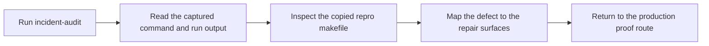

# Incident Review Guide

<!-- page-maps:start -->
## Guide Maps

<!-- page-maps:end -->

Use this guide when you want one executed failure bundle instead of scanning the whole
repro pack. The point is to study one defect class with concrete evidence and then route
that lesson back into the real capstone.

---

## Reading order

Read an incident bundle in this order:

1. `route.txt`
2. `command.txt`
3. `run.txt`
4. `exit-status.txt`
5. the copied repro makefile
6. `repair-surfaces.txt`
7. `REPRO_GUIDE.md`
8. `PROOF_GUIDE.md`

This keeps observed behavior ahead of interpretation.

---

## What each surface gives you

| File | Why it exists |
| --- | --- |
| `command.txt` | records the exact command used to execute the incident |
| `run.txt` | captures the output produced during the incident run |
| `exit-status.txt` | records whether the failure surfaced as a non-zero exit or only as suspicious output |
| copied repro makefile | preserves the smallest defect specimen used for this bundle |
| `repair-surfaces.txt` | points back to the real build surfaces that model the repair honestly |
| `REPRO_GUIDE.md` | places the defect inside the broader repro catalog |
| `PROOF_GUIDE.md` | maps the repaired claim back to the production proof route |

---

## What a good incident review should answer

By the end of one bundle review, you should be able to say:

- which output, edge, or boundary was modeled dishonestly
- whether the defect depends on scheduling or appears in serial mode too
- which repair belongs in the real capstone rather than in the teaching repro
- which proof route would confirm the repaired behavior in production

---

## Good sequence for new readers

If the repro pack is new, start with incidents in this order:

1. shared mutable output
2. directory creation race
3. order-only misuse
4. generated-header modeling

That sequence moves from obvious corruption toward subtler graph lies.

---

## Companion surfaces

- `REPRO_GUIDE.md`
- `PROOF_GUIDE.md`
- `ARCHITECTURE.md`

