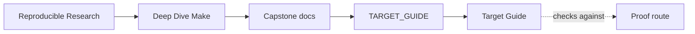
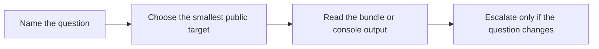

# Target Guide

<!-- page-maps:start -->
## Guide Maps

<!-- page-maps:end -->

Use this guide when `make help` gives you names, but not judgment. The point is not to
memorize every target. The point is to pick the smallest command that answers the
question honestly.

---

## Choose by question

| Question | Start here | Escalate if needed |
| --- | --- | --- |
| what does this repository promise publicly | `make inspect` | `make contract-audit` |
| what are the stable public targets | `make help` | `make inspect` |
| does the ordinary build succeed | `make all` | `make test` |
| does the build graph still tell the truth | `make selftest` | `make verify-report` |
| do I need the proof saved as a review bundle | `make verify-report` | `make proof` |
| what is the shortest human-first route into the capstone | `make walkthrough` | `make tour` |
| which failure class does the repro pack teach | `make incident-audit` | `make repro` |
| what does this repository assume about tools or variable sources | `make profile-audit` | `make portability-audit` and `make show-origins` |
| can this tree be published as source without local residue | `make source-baseline-check` | `make source-bundle` |
| what is the strongest shared stewardship route | `make confirm` | none; this is the top route |

[Back to top](#top)

---

## Stable review targets

| Target | What it produces | Use when |
| --- | --- | --- |
| `help` | the published target list and key variables | you need the supported surface |
| `all` | the ordinary build outputs and convergence sentinel | you need the baseline build result |
| `test` | runtime behavior checks | you need product-facing validation |
| `selftest` | convergence, schedule equivalence, and hidden-input checks | you need build-system proof |
| `walkthrough` | the bounded first-pass bundle | you need an ordered entry route |
| `tour` | the shortest printed walkthrough plus supporting bundle | you need quick orientation |
| `contract-audit` | the public-contract review bundle | you are reviewing promises and boundaries |
| `inspect` | the same contract route under learner-facing naming | you want the smallest honest review route |
| `incident-audit` | one executed incident bundle | you want one failure class with evidence |
| `profile-audit` | the execution-profile review bundle | you are reviewing portability and precedence |
| `selftest-report` | the saved selftest evidence bundle | you need durable proof output |
| `verify-report` | the same selftest bundle under shared catalog naming | you need the catalog label used elsewhere |
| `proof` | the sanctioned multi-bundle review set | one question now spans multiple routes |
| `hardened` | selftest, audits, attestation, and runtime checks | you want the strongest built-in validation body |
| `confirm` | the same strongest route under shared naming | you are closing stewardship review |

[Back to top](#top)

---

## Distinctions that matter

- `all` builds outputs once; `selftest` proves the build contract
- `walkthrough` writes a first-pass bundle; `tour` prints the shortest route and focused follow-ups
- `contract-audit` and `inspect` are the same route with different naming context
- `selftest-report` and `verify-report` are the same saved evidence bundle
- `profile-audit` is about declared execution boundary and variable sources, not raw performance benchmarking
- `proof` is not "better selftest"; it is the point where one review question has become several
- `hardened` and `confirm` are the strongest built-in routes, not the default starting point

[Back to top](#top)

---

## Useful companions

- `PROOF_GUIDE.md`
- `WALKTHROUGH_GUIDE.md`
- `SELFTEST_GUIDE.md`
- `CONTRACT_AUDIT_GUIDE.md`
- `INCIDENT_REVIEW_GUIDE.md`
- `PROFILE_AUDIT_GUIDE.md`
- `SOURCE_BASELINE_GUIDE.md`

[Back to top](#top)
