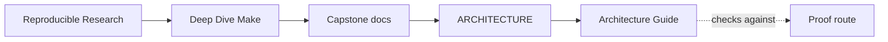
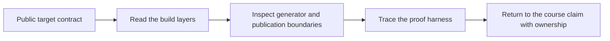
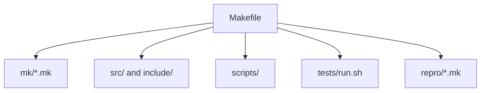

# Architecture Guide

<!-- page-maps:start -->
## Guide Maps

<!-- page-maps:end -->

Use this guide when the capstone feels mechanically correct but the ownership boundaries
are still blurry. The goal is to name which layer owns which responsibility before you
start following individual rules.

---

## Architectural Claim

This capstone is organized so you can separate five concerns without guesswork:

* public entrypoints
* policy and platform boundary
* reusable build mechanics
* graph discovery and modeled hidden inputs
* executed proof and controlled failure surfaces

If those boundaries collapse into one large Makefile in your head, the capstone will feel
clever instead of teachable.

---

## Layer Map

| Surface | Main responsibility | Read first when |
| --- | --- | --- |
| `Makefile` | public targets, target composition, and top-level promises | you need the capstone contract |
| `mk/contract.mk` | tool, shell, and policy boundary | you need platform truth |
| `mk/common.mk`, `mk/macros.mk` | shared mechanics and atomic helpers | you need reusable implementation detail |
| `mk/objects.mk` | rooted discovery and object graph modeling | you need to understand what gets built |
| `mk/stamps.mk` | modeled hidden inputs and state evidence | you need to understand why rebuild truth holds |
| `scripts/` | explicit generators and release helpers | you need generator or packaging boundaries |
| `tests/run.sh` | proof harness for build-system behavior | you need executed evidence |
| `repro/` | tiny failure-class demonstrations | you need one defect class in isolation |

---

## Reading Order By Question

### If the question is public API

1. `Makefile`
2. [TARGET_GUIDE.md](target-guide.md)
3. [PROOF_GUIDE.md](proof-guide.md)

### If the question is graph truth

1. `mk/objects.mk`
2. `mk/stamps.mk`
3. `tests/run.sh`

### If the question is generator boundaries

1. `scripts/gen_dynamic_h.py`
2. `Makefile` rule for `build/include/dynamic.h`
3. `repro/04-generated-header.mk`

### If the question is incident learning

1. [REPRO_GUIDE.md](repro-guide.md)
2. `repro/*.mk`
3. [INCIDENT_REVIEW_GUIDE.md](incident-review-guide.md)

---

## Ownership Table

| Question | Owning surface | Why |
| --- | --- | --- |
| what is publicly supported | `Makefile` and [TARGET_GUIDE.md](target-guide.md) | they define the durable review API |
| what platform assumptions are declared | `mk/contract.mk` | policy belongs in one explicit boundary |
| how discovery stays deterministic | `mk/objects.mk` | object enumeration is rooted there |
| how hidden inputs stay modeled | `mk/stamps.mk` | flag and state stamps are declared there |
| how artifacts are published atomically | `mk/macros.mk` and top-level recipes | publish helpers and target recipes share this contract |
| what the build must prove | `tests/run.sh` and [SELFTEST_GUIDE.md](selftest-guide.md) | proof belongs to the harness, not to README prose |
| how failures are taught | `repro/` and [REPRO_GUIDE.md](repro-guide.md) | controlled defects should stay isolated from the main build |

---

## Best Companion Files

Read these after this guide:

* `README.md` for the repository role
* [TARGET_GUIDE.md](target-guide.md) for the stable command surface
* [PROOF_GUIDE.md](proof-guide.md) for claim-to-evidence routing
* [WALKTHROUGH_GUIDE.md](walkthrough-guide.md) for the first-pass reading order
