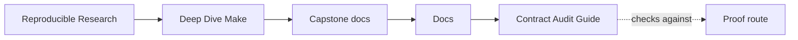
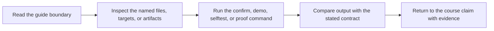

# Contract Audit Guide

<!-- page-maps:start -->
## Guide Maps

<!-- page-maps:end -->

Use this guide when the question is not "does the build run?" but "is the public build
contract explicit enough to trust and teach?"

---

## Reading Order

When the contract audit bundle has been generated, read it in this order:

1. `route.txt`
2. `README.md`
3. `help.txt`
4. `PROOF_GUIDE.md`
5. `portability.txt`
6. `discovery.txt`
7. `tests/run.sh`
8. `review-questions.txt`

That order keeps public promise first, platform boundary second, and graph-discipline
evidence third.

---

## What Each File Is For

| File | What it answers |
| --- | --- |
| `README.md` | what the capstone claims to be |
| `help.txt` | which targets are part of the stable published surface |
| `PROOF_GUIDE.md` | which proof route defends each claim |
| `portability.txt` | which tool and feature assumptions the build declares |
| `discovery.txt` | whether file discovery is rooted and reviewable |
| `tests/run.sh` | which invariants the proof harness actually checks |
| `review-questions.txt` | whether the contract is clear enough for another engineer |

---

## Review Questions That Matter

Ask these before you trust the bundle:

* could another engineer discover the stable target surface from `help.txt` alone
* are GNU Make and shell assumptions declared instead of implied
* does discovery evidence show rooted enumeration rather than convenience globbing
* does the proof route point to executed evidence instead of only README prose

---

## Common Failure Modes

Treat these as contract defects:

* a target is used in course prose but not exposed in `help`
* platform requirements are scattered across comments instead of one boundary file
* rooted discovery is claimed but not shown in the audit output
* proof claims require a maintainer to guess which target or file proves them

---

## Best Companion Guides

Read these with the contract audit:

* `TARGET_GUIDE.md`
* `PROOF_GUIDE.md`
* `ARCHITECTURE.md`

