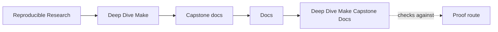
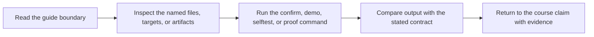

# Deep Dive Make Capstone Docs

<!-- page-maps:start -->
## Guide Maps

<!-- page-maps:end -->

Use this page as the stable entry route for the Make capstone docs.

## Start here by question

| If the question is... | Start here | Escalate only if needed |
| --- | --- | --- |
| what this repository promises | `WALKTHROUGH_GUIDE.md` | `TARGET_GUIDE.md` and `make walkthrough` |
| which public targets are stable | `TARGET_GUIDE.md` | `CONTRACT_AUDIT_GUIDE.md` and `make inspect` |
| how the build proves convergence and parallel safety | `SELFTEST_GUIDE.md` | `PROOF_GUIDE.md` and `make selftest` |
| which failure class the capstone teaches | `REPRO_GUIDE.md` | `INCIDENT_REVIEW_GUIDE.md` and `make incident-audit` |
| how the system is layered | `ARCHITECTURE.md` | `PROFILE_AUDIT_GUIDE.md` and `make proof` |

## Stable local doc surface

- [Architecture Guide](architecture.md)
- [Contract Audit Guide](contract-audit-guide.md)
- [Incident Review Guide](incident-review-guide.md)
- [Profile Audit Guide](profile-audit-guide.md)
- [Proof Guide](proof-guide.md)
- [Repro Guide](repro-guide.md)
- [Selftest Guide](selftest-guide.md)
- [Target Guide](target-guide.md)
- [Walkthrough Guide](walkthrough-guide.md)
