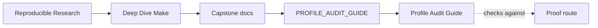
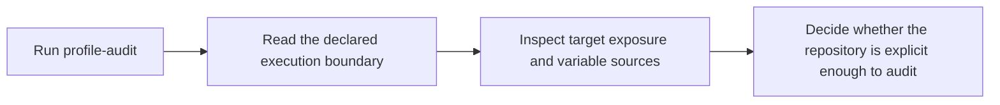

# Profile Audit Guide

<!-- page-maps:start -->
## Guide Maps

<!-- page-maps:end -->

Use this guide when the question is about execution policy rather than product behavior:
tool assumptions, shell expectations, GNU Make features, or variable precedence. This
bundle is an audit route, not a benchmark report.

---

## Reading order

Read the profile audit bundle in this order:

1. `route.txt`
2. `portability.txt`
3. `mk/contract.mk`
4. `help.txt`
5. `TARGET_GUIDE.md`
6. `origins.txt`
7. `PROOF_GUIDE.md`
8. `review-questions.txt`

This keeps declared boundary first, published interface second, and precedence evidence
third.

---

## What each file tells you

| File | Review purpose |
| --- | --- |
| `portability.txt` | records the toolchain, shell, and GNU Make feature boundary |
| `mk/contract.mk` | shows where the policy and platform assumptions are declared in code |
| `help.txt` | shows which targets and variables are actually published |
| `TARGET_GUIDE.md` | explains how the public targets are meant to be used |
| `origins.txt` | captures variable-origin information for precedence review |
| `PROOF_GUIDE.md` | shows how this audit connects to the wider proof surface |
| `review-questions.txt` | forces a concrete judgment instead of vague unease |

---

## What the audit should help you decide

By the end of the profile audit, you should be able to answer:

- which assumptions are hard requirements of this repository
- which parts of the command surface are stable enough for review
- which variables are intended to be overridden, and from which sources
- whether a portability concern belongs in policy, documentation, or a stronger proof route

---

## Common review mistakes

Avoid these:

- treating this audit as a performance benchmark
- reasoning about portability without reading `mk/contract.mk`
- reviewing variable precedence from memory instead of `origins.txt`
- assuming every documented command is part of the stable public surface without checking `help.txt`

---

## Companion guides

- `PROOF_GUIDE.md`
- `TARGET_GUIDE.md`
- `CONTRACT_AUDIT_GUIDE.md`
- `SELFTEST_GUIDE.md`
