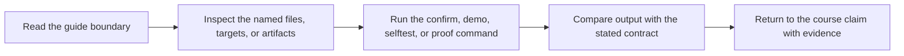

# Proof Guide

<!-- page-maps:start -->
## Guide Maps

<!-- page-maps:end -->

This capstone exists to corroborate build-system claims, not just to compile a small C
program. Use this guide when you know the question you want answered and need the shortest
honest route from that question to evidence.

When you do need the full sanctioned bundle set, run `make proof`. Most of the time,
start narrower.

---

## Start from the claim

| Claim | Smallest honest route | Read these first |
| --- | --- | --- |
| what is publicly promised here | `make inspect` | `CONTRACT_AUDIT_GUIDE.md`, `TARGET_GUIDE.md`, `help.txt` |
| the build converges after success | `make selftest` | `tests/run.sh`, `mk/stamps.mk` |
| serial and parallel schedules produce the same result | `make selftest` | `serial.sum`, `parallel.sum`, `tests/run.sh` |
| proof can be reviewed later without rerunning commands | `make verify-report` | `SELFTEST_GUIDE.md`, `summary.txt`, `settings.env` |
| generated files are modeled as real graph edges | `make proof` | `Makefile`, `scripts/gen_dynamic_h.py`, `repro/04-generated-header.mk` |
| the public contract is explicit enough for another engineer | `make contract-audit` | `README.md`, `TARGET_GUIDE.md`, `portability.txt`, `discovery.txt` |
| variable and execution-policy assumptions are reviewable | `make profile-audit` | `PROFILE_AUDIT_GUIDE.md`, `mk/contract.mk`, `origins.txt` |
| one failure class can be studied with captured evidence | `make incident-audit` | `INCIDENT_REVIEW_GUIDE.md`, `command.txt`, `run.txt`, copied repro file |
| the capstone can be entered without browsing randomly | `make walkthrough` | `WALKTHROUGH_GUIDE.md`, `README.md`, `TARGET_GUIDE.md` |
| this repository still deserves stewardship trust | `make confirm` | `PROOF_GUIDE.md`, `tests/run.sh`, audit bundles as needed |

---

## Good reading order

Use this order when the repository is new but the ideas are not:

1. `README.md` for the repository contract
2. [TARGET_GUIDE.md](target-guide.md) for the public target surface
3. this page for claim-to-route selection
4. `tests/run.sh` for the executed proof harness
5. [ARCHITECTURE.md](architecture.md) and `mk/contract.mk` for ownership and boundary rules
6. the audit or repro guide that matches the current question

That keeps claim, route, and evidence ahead of implementation detail.

---

## Route selection rules

- choose `walkthrough` for first contact
- choose `inspect` for contract review
- choose `selftest` for build-truth proof
- choose `verify-report` when the proof needs to be saved
- choose `incident-audit` for one failure class with captured evidence
- choose `profile-audit` for portability, policy, and precedence questions
- choose `proof` only when the question genuinely spans multiple bundles
- choose `confirm` when stewardship review needs the strongest built-in route

---

## Companion surfaces

Read these with this guide:

- `README.md`
- [TARGET_GUIDE.md](target-guide.md)
- [WALKTHROUGH_GUIDE.md](walkthrough-guide.md)
- [CONTRACT_AUDIT_GUIDE.md](contract-audit-guide.md)
- [INCIDENT_REVIEW_GUIDE.md](incident-review-guide.md)
- [PROFILE_AUDIT_GUIDE.md](profile-audit-guide.md)
- [SELFTEST_GUIDE.md](selftest-guide.md)
