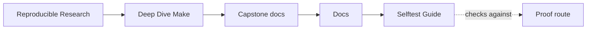
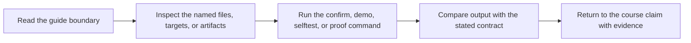

# Selftest Guide

<!-- page-maps:start -->
## Guide Maps

<!-- page-maps:end -->

Use the selftest report when the question is not "does the program run?" but "does the
build still behave honestly under change and concurrency?"
The shared catalog name for this route is `verify-report`, but the evidence itself stays
the same selftest bundle.

## Reading order

1. `summary.txt` to see the top-level proof result.
2. `PROOF_GUIDE.md` to place the selftest bundle inside the wider proof surface.
3. `settings.env` to confirm which make binary and guardrails were used.
4. `convergence.txt` to confirm the graph reaches an up-to-date state.
5. `serial.sum` and `parallel.sum` to compare the artifact inventories across schedules.
6. `trace-count.txt` to confirm observability costs stayed inside the review guardrail.
7. `hidden-input.txt` to confirm the harness can still detect a dishonest boundary.

## What each file proves

- `summary.txt` is the shortest verdict surface for the whole harness.
- `PROOF_GUIDE.md` tells you how this bundle relates to inspect, proof, and confirm.
- `settings.env` records the execution boundary for the run.
- `serial.sum` and `parallel.sum` prove that scheduling changes throughput, not meaning.
- `trace-count.txt` shows whether the build has started doing too much work before the
  real execution phase.
- `hidden-input.txt` proves the harness still catches a graph that lies about its inputs.

## Review questions

- If `summary.txt` says pass, which individual files would you read next to trust that?
- If this bundle passes, which wider route would you choose next: `inspect`, `proof`, or `confirm`?
- If `serial.sum` and `parallel.sum` differ, which build surface probably leaked hidden
  scheduling effects?
- If `hidden-input.txt` stops failing dishonesty, which contract in the main build should
  you inspect first?
