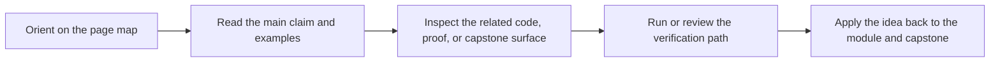

# Artifact Boundary Guide

<!-- page-maps:start -->
## Page Maps

<!-- page-maps:end -->

Deep Dive Make distinguishes between build outputs, proof artifacts, and teaching
surfaces. This page makes those boundaries explicit.

Use it when the capstone contains many files but you need to know which ones are ordinary
build results, which ones are audit evidence, and which ones are only there to teach a
failure class.

---

## Main Boundary Layers

| Surface | Role |
| --- | --- |
| `app`, `build/bin/*`, `build/include/dynamic.h`, `all` | the primary build outputs and convergence sentinel |
| `build/*.o`, `build/*.d`, `build/flags*.stamp` | internal graph artifacts used to model and verify correctness |
| `build/attest.txt`, `dist.tar.gz` | explicit proof or release artifacts that are not required for ordinary builds |
| `repro/*.mk` | teaching surfaces that intentionally demonstrate broken patterns |
| `tests/run.sh` output | the proof harness for build-system behavior rather than product behavior alone |

[Back to top](#top)

---

## What Counts As Public

Treat these as public capstone surfaces:

* the top-level targets shown by `help`
* the files described in [`capstone-file-guide.md`](capstone-file-guide.md)
* the proof routes documented in [`proof-matrix.md`](proof-matrix.md)

Treat other internal helper files and intermediate artifacts as implementation detail
unless the docs promote them intentionally.

[Back to top](#top)

---

## Common Boundary Mistakes

| Mistake | Why it confuses the learner |
| --- | --- |
| treating `build/*.o` as if they were the course deliverable | they are graph evidence, not the learner-facing contract |
| treating `repro/*.mk` as production patterns | they are controlled failures designed for study |
| folding `attest` or `dist` into the normal build path | it mixes proof or release work into ordinary artifact identity |
| assuming the `all` sentinel is just another phony target | it is part of the convergence contract |

[Back to top](#top)

---

## Best Companion Pages

Use these pages with this guide:

* [`public-targets.md`](public-targets.md)
* [`capstone-file-guide.md`](capstone-file-guide.md)
* [`capstone-proof-checklist.md`](capstone-proof-checklist.md)

[Back to top](#top)
