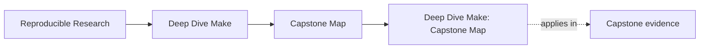
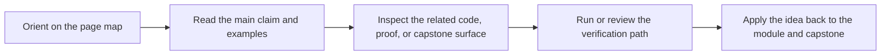

# Deep Dive Make: Capstone Map

<!-- page-maps:start -->
## Page Maps

<!-- page-maps:end -->

The capstone is not the first stop for every lesson. It is the executable cross-check for
the program once a concept is already legible in a smaller local exercise.

Use this page when you want one answer to three questions:

1. When should I enter the capstone?
2. Which files or targets match the module I am studying?
3. What command proves the concept instead of merely describing it?

---

## Before You Enter

Check these first:

* Can you already explain the concept on a smaller local graph?
* Do you know which command should prove the behavior?
* Are you looking for confirmation, not first exposure?

If the answer to any of those is no, return to the module exercise before using the
capstone.

[Back to top](#top)

---

## Recommended Entry Rule

Use the capstone sparingly in Modules 01-02, heavily in Modules 03-09, and as a review
specimen in Module 10.

If you are still learning basic syntax, keep working in the local module playgrounds
first. The capstone is designed to confirm understanding, not replace first-contact
teaching.

---

## Three Reliable Entry Routes

### Route A: First serious capstone pass

Use this after Module 02 or 03.

1. `make -C capstone help`
2. `make -C capstone walkthrough`
3. read `capstone/Makefile`
4. read `capstone/tests/run.sh`
5. run `make -C capstone selftest`

### Route B: Generator and boundary study

Use this during Module 06.

1. read `capstone/scripts/gen_dynamic_h.py`
2. trace `build/include/dynamic.h` from `capstone/Makefile`
3. inspect `capstone/mk/stamps.mk`
4. run `make -C capstone --trace dyn`

### Route C: Architecture and stewardship review

Use this during Modules 07-10.

1. run `make -C capstone help`
2. read `capstone/mk/*.mk` in dependency order
3. inspect `capstone/repro/`
4. run `make -C capstone -p > build/review.dump`

[Back to top](#top)

---

## Module-to-Capstone Route

| Module | Learner goal | Capstone surfaces | Proof command |
| --- | --- | --- | --- |
| 01 Foundations | See a truthful graph and atomic publication at small scale | `capstone/Makefile`, `capstone/src/`, `capstone/include/` | `make -C capstone -n all` |
| 02 Scaling | Watch parallel safety and deterministic discovery under pressure | `capstone/repro/`, `capstone/mk/objects.mk`, `capstone/tests/run.sh` | `make -C capstone selftest` |
| 03 Production Practice | See CI-stable targets and build-system selftests | `capstone/Makefile`, `capstone/tests/run.sh`, `capstone/mk/macros.mk` | `make -C capstone selftest` |
| 04 Semantics Under Pressure | Inspect precedence, help surface, and optional rule generation | `capstone/Makefile`, `capstone/mk/rules_eval.mk` | `make -C capstone show-origins` |
| 05 Hardening | Confirm portability boundaries, attestations, and guarded recursion | `capstone/mk/contract.mk`, `capstone/Makefile`, `capstone/thirdparty/` | `make -C capstone hardened` |
| 06 Generated Files | Follow the generated-header path and boundary files | `capstone/scripts/`, `capstone/mk/stamps.mk`, `capstone/Makefile` | `make -C capstone --trace dyn` |
| 07 Build Architecture | Read the layered `mk/*.mk` structure as a public API | `capstone/Makefile`, `capstone/mk/*.mk` | `make -C capstone help` |
| 08 Release Engineering | Inspect packaging and evidence surfaces without polluting identity | `capstone/Makefile`, `capstone/scripts/mkdist.py`, `capstone/build/attest.txt` | `make -C capstone dist attest` |
| 09 Incident Response | Measure trace volume and operational diagnostics | `capstone/tests/run.sh`, `capstone/Makefile`, `capstone/repro/` | `make -C capstone trace-count` |
| 10 Mastery | Review the whole build as a migration and governance specimen | `capstone/Makefile`, `capstone/mk/`, `capstone/repro/`, `capstone/tests/` | `make -C capstone help && make -C capstone -p > build/review.dump` |

[Back to top](#top)

---

## What To Inspect First

| Surface | Why it matters | When it matters most |
| --- | --- | --- |
| `capstone/Makefile` | public targets and rule boundaries | Modules 03, 07, 10 |
| `capstone/tests/run.sh` | proof harness and invariants | Modules 03, 05, 09 |
| `capstone/mk/objects.mk` | rooted discovery and object graph modeling | Modules 02, 03, 07 |
| `capstone/mk/stamps.mk` | modeled hidden inputs and boundary files | Modules 05, 06 |
| `capstone/repro/` | controlled demonstrations of failure classes | Modules 02, 09, 10 |
| `capstone/scripts/` | generator and packaging boundaries | Modules 06, 08 |

[Back to top](#top)

---

## First Capstone Tour

If you want a sane first walkthrough, use this order:

1. Read `capstone/Makefile` from the public targets down to the build rules.
2. Run `make -C capstone walkthrough` to materialize the learner-first bundle.
3. Read `capstone/mk/objects.mk` and `capstone/mk/stamps.mk` to see discovery and modeled inputs.
4. Read `capstone/tests/run.sh` to see what the build is actually required to prove.
5. Run `make -C capstone selftest` and compare the output to the course claims.

This route keeps the learner focused on contract first, mechanics second.

[Back to top](#top)

---

## Fast Routes by Goal

Use these shortcuts when you are returning later for one kind of question:

| Goal | Start here | Then inspect |
| --- | --- | --- |
| Why did this rebuild? | `make -C capstone --trace all` | `capstone/mk/stamps.mk`, `capstone/mk/objects.mk` |
| Why is `-j` unsafe? | `make -C capstone selftest` | `capstone/repro/`, `capstone/tests/run.sh` |
| How is code generation modeled? | `make -C capstone --trace dyn` | `capstone/scripts/`, generated-header rules in `capstone/Makefile` |
| Where is the public API? | `make -C capstone help` | top-level targets in `capstone/Makefile` |
| What counts as hardened? | `make -C capstone hardened` | `capstone/mk/contract.mk`, `capstone/Makefile` |
| What would I review before migration? | `make -C capstone -p > build/review.dump` | `capstone/mk/`, `capstone/tests/`, `capstone/repro/` |

[Back to top](#top)

---

## Capstone Discipline

Use the capstone correctly:

* read the module first, then verify in the capstone
* trust commands and files more than prose summaries
* prefer one investigation question at a time
* treat repros as training material, not as production patterns

If the capstone ever feels larger than the concept you are studying, step back to the
module playground and return after the smaller exercise makes the graph legible again.

[Back to top](#top)
