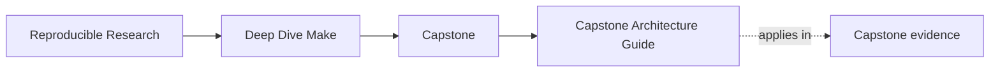

# Capstone Architecture Guide

<!-- page-maps:start -->
## Page Maps

<!-- page-maps:end -->

Use this page when the question is about build ownership rather than about one command.
The Make capstone stays reviewable only if public targets, graph modeling, helper logic,
proof, and failure specimens each keep a readable home.

## Boundary map

| Boundary | First files to inspect | What that boundary owns |
| --- | --- | --- |
| public build contract | `capstone/Makefile` | supported targets and entrypoints |
| layered build policy | `capstone/mk/contract.mk` and `capstone/mk/common.mk` | shell, tool, and shared policy choices |
| graph membership and dependencies | `capstone/mk/objects.mk` and `capstone/mk/stamps.mk` | what belongs in the graph and which hidden inputs are modeled |
| proof harness | `capstone/tests/run.sh` | convergence, serial and parallel equivalence, and negative checks |
| release and packaging surfaces | `capstone/scripts/` and `capstone/docs/` | packaging, publish boundaries, and guided review material |
| failure specimen surfaces | `capstone/repro/` | isolated broken examples that expose one defect class clearly |

## Read the repository in this order

1. Start with `Makefile` to see the public contract.
2. Read `mk/` only after the public entrypoints are legible.
3. Read `tests/run.sh` before making claims about proof strength.
4. Read `repro/` only when the current question is about failure classes.

## What this guide should prevent

- mistaking helper reuse for ownership clarity
- treating repro files as part of the healthy build path
- judging parallel safety without checking the proof harness
