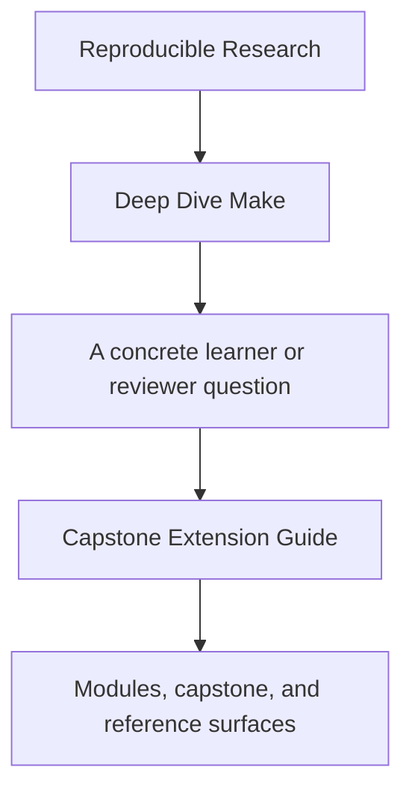
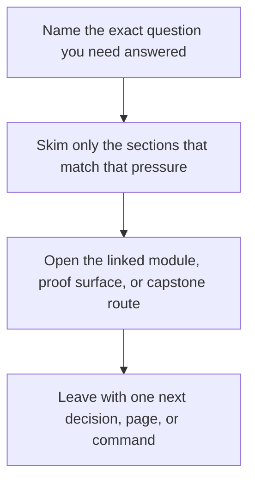

<a id="top"></a>

# Capstone Extension Guide


<!-- page-maps:start -->
## Guide Fit




<!-- page-maps:end -->

Read the first diagram as a timing map: this guide is for a named pressure, not for wandering the whole course-book. Read the second diagram as the guide loop: arrive with a concrete question, use only the matching sections, then leave with one smaller and more honest next move.

Read the first diagram as a timing map: this guide is for a named pressure, not for wandering the whole course-book. Read the second diagram as the guide loop: arrive with a concrete question, use only the matching sections, then leave with one smaller and more honest next move.

Read the first diagram as a timing map: this guide is for a named pressure, not for wandering the whole course-book. Read the second diagram as the guide loop: arrive with a concrete question, use only the matching sections, then leave with one smaller and more honest next move.

This page exists for maintainers who want to evolve the capstone without diluting its
teaching value or its correctness contract.

---

## What Must Stay Stable

Any capstone change should preserve these properties unless the course itself is being
redesigned deliberately:

* truthful dependency modeling
* atomic publication
* serial and parallel equivalence
* a small enough surface area for end-to-end auditability
* public targets that remain clear to a learner

[Back to top](#top)

---

## Safe Kinds Of Changes

These are usually good changes:

* clarifying a public target description
* adding a new repro that teaches a distinct failure class
* improving selftest diagnostics without weakening its assertions
* adding one more explicit boundary file or generator dependency
* tightening docs so the capstone is easier to read in order

[Back to top](#top)

---

## Risky Kinds Of Changes

These need extra discipline:

* increasing repository size without increasing teaching value
* adding abstraction layers that hide the graph
* turning internal helper rules into undocumented public surfaces
* weakening selftest because a defect is inconvenient on one machine
* mixing release evidence into artifact identity

[Back to top](#top)

---

## Best Review Checklist

Before merging a capstone change, confirm:

1. which learner question the change improves
2. which public target or file responsibility changed
3. whether `selftest` still proves the same contract
4. whether the new surface is still easy to audit end to end
5. whether a future maintainer would understand the intent from the filename and commit message alone

[Back to top](#top)

---

## Best Commands To Re-Run

```sh
gmake -C capstone help
gmake -C capstone tour
gmake -C capstone repro
gmake -C capstone selftest
```

Use GNU Make on macOS so the course contract is being tested against the intended tool.

[Back to top](#top)
