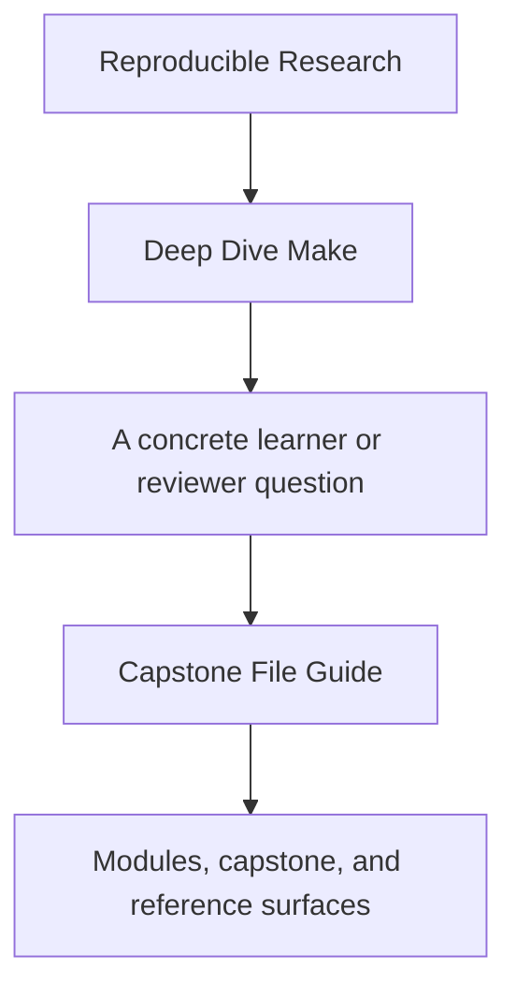
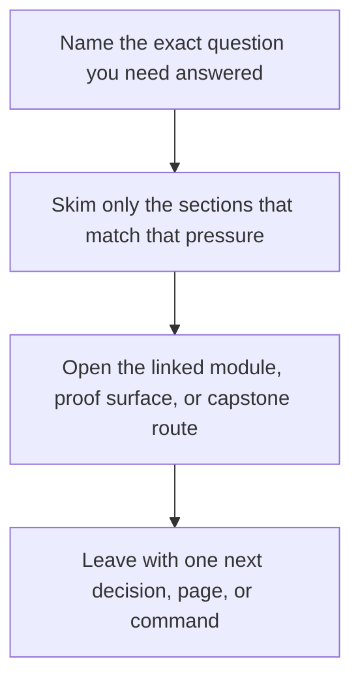

# Capstone File Guide

<!-- page-maps:start -->
## Guide Fit

<!-- page-maps:end -->

Read the first diagram as a timing map: this guide is for a named pressure, not for wandering the whole course-book. Read the second diagram as the guide loop: arrive with a concrete question, use only the matching sections, then leave with one smaller and more honest next move.

Read the first diagram as a timing map: this guide is for a named pressure, not for wandering the whole course-book. Read the second diagram as the guide loop: arrive with a concrete question, use only the matching sections, then leave with one smaller and more honest next move.

Read the first diagram as a timing map: this guide is for a named pressure, not for wandering the whole course-book. Read the second diagram as the guide loop: arrive with a concrete question, use only the matching sections, then leave with one smaller and more honest next move.

This page explains which capstone files matter first and what responsibility each one
holds.

Use it when the repository feels legible at a directory level but not yet at a file level.

---

## Start With These Files

| File | Why it matters |
| --- | --- |
| `capstone/Makefile` | defines the public targets and the top-level build contract |
| `capstone/tests/run.sh` | shows what the build is required to prove |
| `capstone/mk/objects.mk` | models deterministic discovery and object mapping |
| `capstone/mk/stamps.mk` | models hidden inputs and boundary files |
| `capstone/mk/contract.mk` | declares portability and feature assumptions |
| `capstone/scripts/gen_dynamic_h.py` | provides the simplest generator boundary to inspect |
| `capstone/scripts/mkdist.py` | shows how release packaging is separated from ordinary build work |

[Back to top](#top)

---

## Directory Responsibilities

| Path | Responsibility |
| --- | --- |
| `capstone/mk/` | shared build mechanics split by concern |
| `capstone/src/` | source files used to exercise build behavior |
| `capstone/include/` | static headers for the small C project |
| `capstone/scripts/` | explicit generator and packaging helpers |
| `capstone/tests/` | proof harness for build-system behavior |
| `capstone/repro/` | isolated failure demonstrations for teaching and debugging |
| `capstone/thirdparty/` | controlled recursion and boundary examples |

[Back to top](#top)

---

## Best Reading Order

1. `capstone/Makefile`
2. `capstone/tests/run.sh`
3. `capstone/mk/objects.mk`
4. `capstone/mk/stamps.mk`
5. one file under `capstone/repro/`
6. `capstone/scripts/gen_dynamic_h.py`
7. `capstone/scripts/mkdist.py`

This order keeps the learner anchored in contract, then proof, then mechanics, then
examples.

[Back to top](#top)

---

## Common Wrong Reading Order

Avoid starting with:

* random `mk/*.mk` files without first reading the public targets
* repro files before understanding what the healthy build promises
* scripts before understanding why the build calls them

That route teaches fragments without context.

[Back to top](#top)
