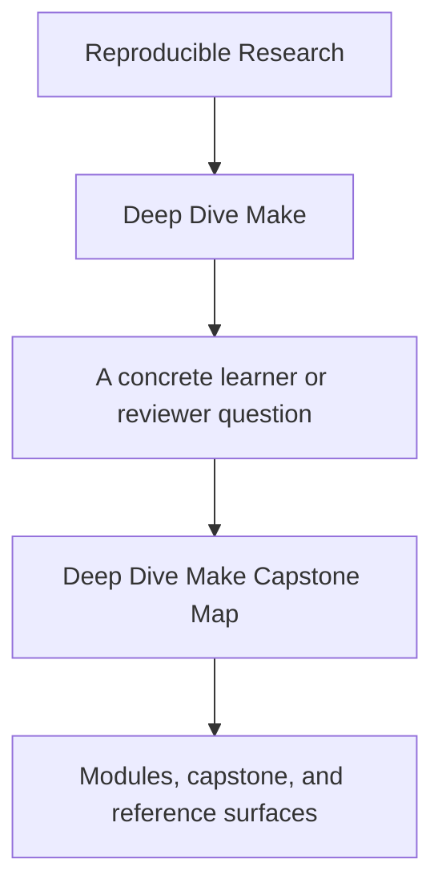
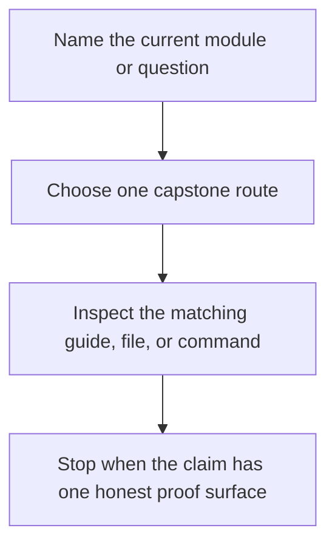

# Deep Dive Make Capstone Map

<!-- page-maps:start -->
## Guide Fit

<!-- page-maps:end -->

Read the first diagram as a timing map: the capstone is a corroboration surface, not the
first lesson. Read the second diagram as the route rule: choose one capstone route by
module or question, inspect the matching surface, then stop when one honest proof route
is visible.

## Enter the capstone at the right time

Enter only when the module idea is already legible in the local exercise.

Return to the module first if:

- you cannot yet explain the concept on a smaller graph
- you do not know which command should prove the behavior
- the repository feels larger than the concept you are studying

## Choose the route by question

| If the question is... | Start here | Escalate only if needed |
| --- | --- | --- |
| what this repository promises | [Capstone Guide](index.md) | [Capstone Walkthrough](capstone-walkthrough.md) |
| which repository surface matches the current module | the table below | [Command Guide](command-guide.md) |
| which command should prove the current claim | [Command Guide](command-guide.md) | [Capstone Proof Checklist](capstone-proof-checklist.md) |
| which files own the behavior | [Capstone File Guide](capstone-file-guide.md) | [Capstone Architecture Guide](capstone-architecture-guide.md) |
| whether the whole repository holds together as a specimen | [Capstone Review Worksheet](capstone-review-worksheet.md) | [Capstone Extension Guide](capstone-extension-guide.md) |

## Choose the route by module arc

| Module arc | What should already be clear locally | First capstone route |
| --- | --- | --- |
| Modules 01-02 | truthful edges, atomic publication, and one parallel race you can explain | [Capstone Walkthrough](capstone-walkthrough.md) |
| Modules 03-05 | selftests, public targets, portability boundaries, and one negative proof | [Command Guide](command-guide.md) then [Capstone Proof Checklist](capstone-proof-checklist.md) |
| Modules 06-08 | generator boundaries, layered `mk/` design, and release surfaces | [Capstone Architecture Guide](capstone-architecture-guide.md) |
| Modules 09-10 | incident judgment, stewardship review, and migration boundaries | [Capstone Review Worksheet](capstone-review-worksheet.md) |

## Module-to-capstone map

| Module | Main learner question | Capstone surface | First command |
| --- | --- | --- | --- |
| 01 Foundations | what makes a graph truthful instead of lucky | `Makefile`, `src/`, `include/` | `make walkthrough` |
| 02 Scaling | what breaks under `-j` when the graph lies | `repro/`, `mk/objects.mk`, `tests/run.sh` | `make selftest` |
| 03 Production Practice | how a build proves convergence and equivalence | `tests/run.sh`, `docs/SELFTEST_GUIDE.md` | `make verify-report` |
| 04 Semantics Under Pressure | how precedence and rule choice stay legible | `Makefile`, `mk/rules_eval.mk` | `make inspect` |
| 05 Hardening | where portability and hidden-input boundaries live | `mk/contract.mk`, `mk/stamps.mk` | `make contract-audit` |
| 06 Generated Files | how generation enters the graph honestly | `scripts/`, `mk/stamps.mk` | `make proof` |
| 07 Build Architecture | how layered includes become a public build surface | `mk/*.mk`, `docs/ARCHITECTURE.md` | `make inspect` |
| 08 Release Engineering | how release artifacts stay reviewable | `scripts/mkdist.py`, `build/attest.txt` | `make proof` |
| 09 Incident Response | how failures become inspectable instead of superstitious | `repro/`, `docs/INCIDENT_REVIEW_GUIDE.md` | `make incident-audit` |
| 10 Governance | whether another maintainer could extend or migrate the build safely | `mk/`, `tests/`, `repro/` | `make confirm` |

## Good stopping point

Stop when you can name one capstone surface, one command, and one reason they are
enough for the current module or question. If you still feel pulled toward the whole
repository, step back to the smaller route.
