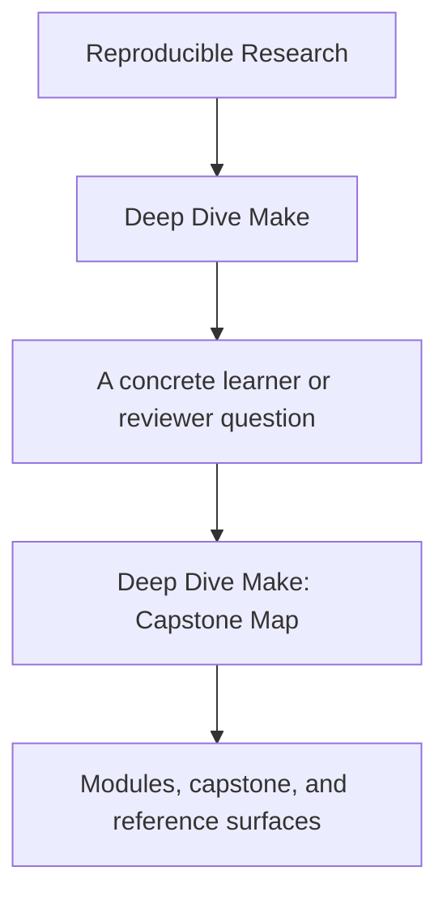
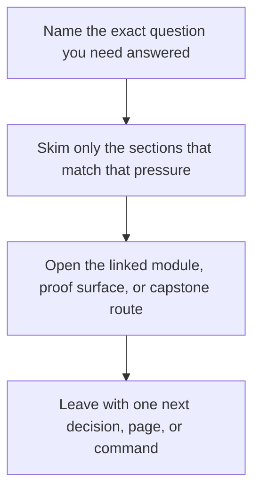

# Deep Dive Make: Capstone Map

<!-- page-maps:start -->
## Guide Fit

<!-- page-maps:end -->

Read the first diagram as a timing map: this guide is for a named pressure, not for wandering the whole course-book. Read the second diagram as the guide loop: arrive with a concrete question, use only the matching sections, then leave with one smaller and more honest next move.

Read the first diagram as a timing map: this guide is for a named pressure, not for wandering the whole course-book. Read the second diagram as the guide loop: arrive with a concrete question, use only the matching sections, then leave with one smaller and more honest next move.

Read the first diagram as a timing map: this guide is for a named pressure, not for wandering the whole course-book. Read the second diagram as the guide loop: arrive with a concrete question, use only the matching sections, then leave with one smaller and more honest next move.

The capstone is not the first stop for every lesson. It is the executable cross-check for
the program once a concept is already legible in a smaller local exercise.

Use this page when you want one answer to three questions:

1. When should I enter the capstone?
2. Which files or targets match the module I am studying?
3. What command proves the concept instead of merely describing it?

---

## Before You Enter

Check these first:

* Can you already explain the concept on a smaller local graph?
* Do you know which command should prove the behavior?
* Are you looking for confirmation, not first exposure?

If the answer to any of those is no, return to the module exercise before using the
capstone.

[Back to top](#top)

---

## Recommended Entry Rule

Use the capstone sparingly in Modules 01-02, heavily in Modules 03-09, and as a review
specimen in Module 10.

If you are still learning basic syntax, keep working in the local module playgrounds
first. The capstone is designed to confirm understanding, not replace first-contact
teaching.

---

## Enter by Module Arc

Use the capstone differently depending on where you are in the course:

| Module arc | What you should already know locally | First honest capstone route |
| --- | --- | --- |
| Modules 01-02 | truthful edges, atomic publication, and one parallel race you can explain | `make PROGRAM=reproducible-research/deep-dive-make capstone-walkthrough` |
| Modules 03-05 | selftests, public targets, portability boundaries, and one negative proof | `make PROGRAM=reproducible-research/deep-dive-make inspect` then `make PROGRAM=reproducible-research/deep-dive-make capstone-verify-report` |
| Modules 06-09 | generator boundaries, layered `mk/*.mk`, release contracts, and one incident ladder | `make PROGRAM=reproducible-research/deep-dive-make proof` |
| Module 10 | review method, migration rubric, and governance rules | `make PROGRAM=reproducible-research/deep-dive-make capstone-confirm` |

If you cannot explain the local exercise yet, do not escalate to the capstone. The
capstone is where the module claims are corroborated under a larger surface, not where
they are first discovered.

[Back to top](#top)

---

## Enter By Question Type

Use the question, not your anxiety level, to choose the route:

| Question type | Start here | Escalate only if needed |
| --- | --- | --- |
| what does this repository promise | `capstone-walkthrough` | `inspect` |
| is the public build contract clear | `inspect` | `capstone-contract-audit` |
| does the build still hold under proof | `test` | `capstone-verify-report` |
| which failure class is this teaching | `capstone-incident-audit` | `proof` |
| should I trust the full system as a steward | `proof` | `capstone-confirm` |

[Back to top](#top)

---

## Three Reliable Entry Routes

### Route A: First serious capstone pass for Modules 01-03

Use this after Module 02 or 03.

1. `make PROGRAM=reproducible-research/deep-dive-make capstone-walkthrough`
2. read the capstone's local [`WALKTHROUGH_GUIDE.md`](https://github.com/bijux/bijux-masterclass/blob/master/programs/reproducible-research/deep-dive-make/capstone/docs/WALKTHROUGH_GUIDE.md)
3. read the capstone's local [`TARGET_GUIDE.md`](https://github.com/bijux/bijux-masterclass/blob/master/programs/reproducible-research/deep-dive-make/capstone/docs/TARGET_GUIDE.md)
4. read `capstone/Makefile` and `capstone/tests/run.sh`
5. run `make PROGRAM=reproducible-research/deep-dive-make test`

### Route B: Generator and boundary study for Modules 06-08

Use this during Module 06.

1. read `capstone/scripts/gen_dynamic_h.py`
2. trace `build/include/dynamic.h` from `capstone/Makefile`
3. inspect `capstone/mk/stamps.mk`
4. read the capstone's local [`ARCHITECTURE.md`](https://github.com/bijux/bijux-masterclass/blob/master/programs/reproducible-research/deep-dive-make/capstone/docs/ARCHITECTURE.md)
5. run `gmake -C capstone --trace dyn`

### Route C: Architecture and stewardship review for Modules 07-10

Use this during Modules 07-10.

1. run `make PROGRAM=reproducible-research/deep-dive-make inspect`
2. read the capstone's local [`ARCHITECTURE.md`](https://github.com/bijux/bijux-masterclass/blob/master/programs/reproducible-research/deep-dive-make/capstone/docs/ARCHITECTURE.md)
3. read `capstone/mk/*.mk` in dependency order
4. inspect `capstone/repro/`
5. run `gmake -C capstone -p > build/review.dump`

[Back to top](#top)

---

## Module-to-Capstone Route

| Module | Learner goal | Capstone surfaces | First capstone command |
| --- | --- | --- | --- |
| 01 Foundations | See a truthful graph and atomic publication at small scale | `capstone/Makefile`, `capstone/src/`, `capstone/include/` | `make PROGRAM=reproducible-research/deep-dive-make capstone-walkthrough` |
| 02 Scaling | Watch parallel safety and deterministic discovery under pressure | `capstone/repro/`, `capstone/mk/objects.mk`, `capstone/tests/run.sh` | `make PROGRAM=reproducible-research/deep-dive-make test` |
| 03 Production Practice | See CI-stable targets and build-system selftests | `capstone/Makefile`, `capstone/tests/run.sh`, `capstone/mk/macros.mk` | `make PROGRAM=reproducible-research/deep-dive-make capstone-verify-report` |
| 04 Semantics Under Pressure | Inspect precedence, help surface, and optional rule generation | `capstone/Makefile`, `capstone/mk/rules_eval.mk` | `make PROGRAM=reproducible-research/deep-dive-make capstone-tour` |
| 05 Hardening | Confirm portability boundaries, attestations, and guarded recursion | `capstone/mk/contract.mk`, `capstone/Makefile`, `capstone/thirdparty/` | `make PROGRAM=reproducible-research/deep-dive-make capstone-contract-audit` |
| 06 Generated Files | Follow the generated-header path and boundary files | `capstone/scripts/`, `capstone/mk/stamps.mk`, `capstone/Makefile` | `make PROGRAM=reproducible-research/deep-dive-make proof` |
| 07 Build Architecture | Read the layered `mk/*.mk` structure as a public API | `capstone/Makefile`, `capstone/mk/*.mk` | `make PROGRAM=reproducible-research/deep-dive-make inspect` |
| 08 Release Engineering | Inspect packaging and evidence surfaces without polluting identity | `capstone/Makefile`, `capstone/scripts/mkdist.py`, `capstone/build/attest.txt` | `make PROGRAM=reproducible-research/deep-dive-make proof` |
| 09 Incident Response | Measure trace volume and operational diagnostics | `capstone/tests/run.sh`, `capstone/Makefile`, `capstone/repro/` | `make PROGRAM=reproducible-research/deep-dive-make capstone-incident-audit` |
| 10 Mastery | Review the whole build as a migration and governance specimen | `capstone/Makefile`, `capstone/mk/`, `capstone/repro/`, `capstone/tests/` | `make PROGRAM=reproducible-research/deep-dive-make capstone-confirm` |

[Back to top](#top)

---

## What To Inspect First

| Surface | Why it matters | When it matters most |
| --- | --- | --- |
| `capstone/Makefile` | public targets and rule boundaries | Modules 03, 07, 10 |
| local `TARGET_GUIDE.md` | maps questions to the smallest honest target | Modules 03, 07, 10 |
| local `ARCHITECTURE.md` | names which layer owns which responsibility | Modules 06, 07, 10 |
| `capstone/tests/run.sh` | proof harness and invariants | Modules 03, 05, 09 |
| `capstone/mk/objects.mk` | rooted discovery and object graph modeling | Modules 02, 03, 07 |
| `capstone/mk/stamps.mk` | modeled hidden inputs and boundary files | Modules 05, 06 |
| `capstone/repro/` | controlled demonstrations of failure classes | Modules 02, 09, 10 |
| `capstone/scripts/` | generator and packaging boundaries | Modules 06, 08 |

[Back to top](#top)

---

## First Capstone Tour

If you want a sane first walkthrough, use this order:

1. Read `capstone/Makefile` from the public targets down to the build rules.
2. Read the capstone's local [`WALKTHROUGH_GUIDE.md`](https://github.com/bijux/bijux-masterclass/blob/master/programs/reproducible-research/deep-dive-make/capstone/docs/WALKTHROUGH_GUIDE.md).
3. Run `make PROGRAM=reproducible-research/deep-dive-make capstone-walkthrough` to materialize the learner-first bundle.
4. Read `capstone/mk/objects.mk` and `capstone/mk/stamps.mk` to see discovery and modeled inputs.
5. Read `capstone/tests/run.sh` to see what the build is actually required to prove.
6. Run `make PROGRAM=reproducible-research/deep-dive-make test` and compare the output to the course claims.

This route keeps the learner focused on contract first, mechanics second.

[Back to top](#top)

---

## Fast Routes by Goal

Use these shortcuts when you are returning later for one kind of question:

| Goal | Start here | Then inspect |
| --- | --- | --- |
| Why did this rebuild? | `make -C capstone --trace all` | `capstone/mk/stamps.mk`, `capstone/mk/objects.mk` |
| Why is `-j` unsafe? | `make -C capstone selftest` | `capstone/repro/`, `capstone/tests/run.sh` |
| How is code generation modeled? | `make -C capstone --trace dyn` | `capstone/scripts/`, generated-header rules in `capstone/Makefile` |
| Where is the public API? | `make -C capstone help` | top-level targets in `capstone/Makefile` |
| What counts as hardened? | `make -C capstone hardened` | `capstone/mk/contract.mk`, `capstone/Makefile` |
| What would I review before migration? | `make -C capstone -p > build/review.dump` | `capstone/mk/`, `capstone/tests/`, `capstone/repro/` |

[Back to top](#top)

---

## Capstone Discipline

Use the capstone correctly:

* read the module first, then verify in the capstone
* trust commands and files more than prose summaries
* prefer one investigation question at a time
* treat repros as training material, not as production patterns

If the capstone ever feels larger than the concept you are studying, step back to the
module playground and return after the smaller exercise makes the graph legible again.

[Back to top](#top)
