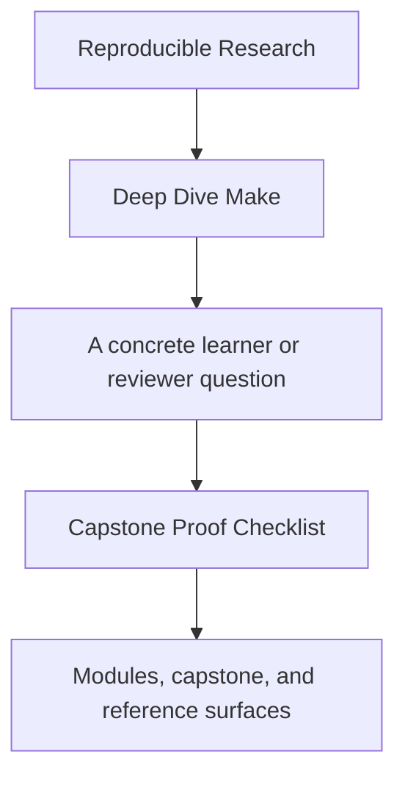
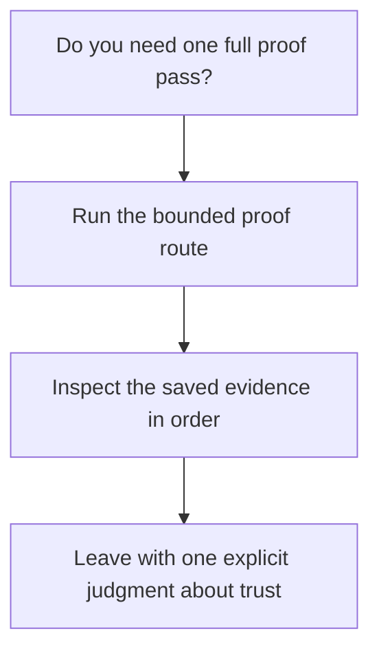

# Capstone Proof Checklist

<!-- page-maps:start -->
## Guide Fit

<!-- page-maps:end -->

Read the first diagram as a timing map: this checklist is for one end-to-end proof pass,
not for first contact. Read the second diagram as the rule: run the bounded proof route,
inspect the evidence in order, then leave with one explicit judgment about trust.

Use this checklist after Module 03, or later when you need a steward-level review route
before incident, profile, or migration questions.

## Bounded proof pass

1. Run `make PROGRAM=reproducible-research/deep-dive-make proof`.
2. Read [Command Guide](command-guide.md).
3. Read `capstone/Makefile` and `capstone/tests/run.sh`.
4. Inspect `artifacts/proof/reproducible-research/deep-dive-make/selftest/`.
5. Inspect `artifacts/audit/reproducible-research/deep-dive-make/contract/`.
6. Inspect `artifacts/audit/reproducible-research/deep-dive-make/incident/`.
7. Inspect `artifacts/audit/reproducible-research/deep-dive-make/profile/`.
8. If you still need failure-class study after the bounded proof route, step down into `programs/reproducible-research/deep-dive-make/capstone/` and run `gmake repro`.

## Questions this proof pass should answer

- what `selftest` proves that `all` does not
- where the public contract becomes inspectable
- where hidden inputs and generated boundaries are made visible
- which saved bundle would matter most to another maintainer
- which repro teaches a real failure class instead of a toy surprise

## Good stopping point

Stop when you can write one explicit judgment in your own words:

- trust the build contract as-is
- trust it with one named boundary to revisit
- do not trust it yet because one specific proof surface is still missing

If you cannot make one of those judgments, repeat the bounded route before adding more
commands.

## Best follow-up routes

- Read [Capstone File Guide](capstone-file-guide.md) when the open question is file ownership.
- Read [Proof Matrix](../guides/proof-matrix.md) when the open question is claim-to-evidence routing.
- Read [Repro Catalog](repro-catalog.md) when the open question is failure-class study.
