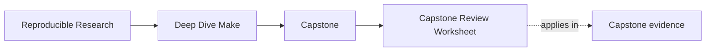

# Capstone Review Worksheet

<!-- page-maps:start -->
## Page Maps

<!-- page-maps:end -->

Use this page when you want to review the capstone as an inherited build, not just read
it as course material. The point is to leave with explicit judgments you could defend in
code review, maintenance planning, or a handoff.

## How to use the worksheet

Work top to bottom. For each section:

1. answer the question in your own words
2. name the file or saved bundle that supports the answer
3. record one risk only if you can point to the owning boundary

If you cannot name the evidence, the judgment is still too soft.

## Public contract

Ask:

- which targets are clearly public for review and maintenance
- whether `help` and the command docs are enough to start correctly
- which commands are aliases for a guided route rather than separate contracts

Best evidence:

- `capstone/Makefile`
- [Command Guide](command-guide.md)
- `artifacts/audit/reproducible-research/deep-dive-make/contract/help.txt`

## Truth and convergence

Ask:

- where hidden inputs are modeled
- what file acts as the convergence proof surface
- what would make the build appear healthy while still lying

Best evidence:

- `capstone/mk/stamps.mk`
- `capstone/tests/run.sh`
- `artifacts/proof/reproducible-research/deep-dive-make/selftest/summary.txt`

## Parallel safety

Ask:

- which outputs have one clear writer
- which failures only appear under `-j`
- whether the repro pack teaches the same failure classes the healthy build protects against

Best evidence:

- `capstone/Makefile`
- `capstone/repro/`
- [Capstone Proof Guide](capstone-proof-guide.md)

## Architecture and ownership

Ask:

- whether each `mk/*.mk` file has one readable job
- whether macros reduce repetition without hiding control flow
- whether a new maintainer could locate policy, discovery, and proof without guesswork

Best evidence:

- `capstone/mk/contract.mk`
- `capstone/mk/objects.mk`
- `capstone/mk/macros.mk`
- [Capstone File Guide](capstone-file-guide.md)

## Release and stewardship

Ask:

- what counts as publishable source versus local build residue
- whether release evidence is adjacent to artifacts rather than mixed into their identity
- whether the build can be extended without weakening the review bar

Best evidence:

- `capstone/docs/target-guide.md`
- `capstone/scripts/mkdist.py`
- [Capstone Extension Guide](capstone-extension-guide.md)

## Record the result

Finish with one of these judgments:

- trust as-is
- trust with one named follow-up boundary
- do not trust yet because one specific proof or ownership question is unresolved

If your conclusion is longer than a short paragraph, the review probably drifted away from
one bounded question.

## Failure-study prompts

Use these when the review question is about a broken specimen rather than the healthy
build:

- Which output or directory has more than one effective writer?
- Which edge should affect staleness rather than only sequencing?
- Which repair would make the graph more truthful instead of only hiding the symptom?
