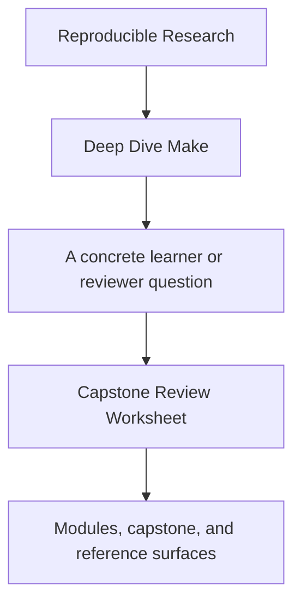
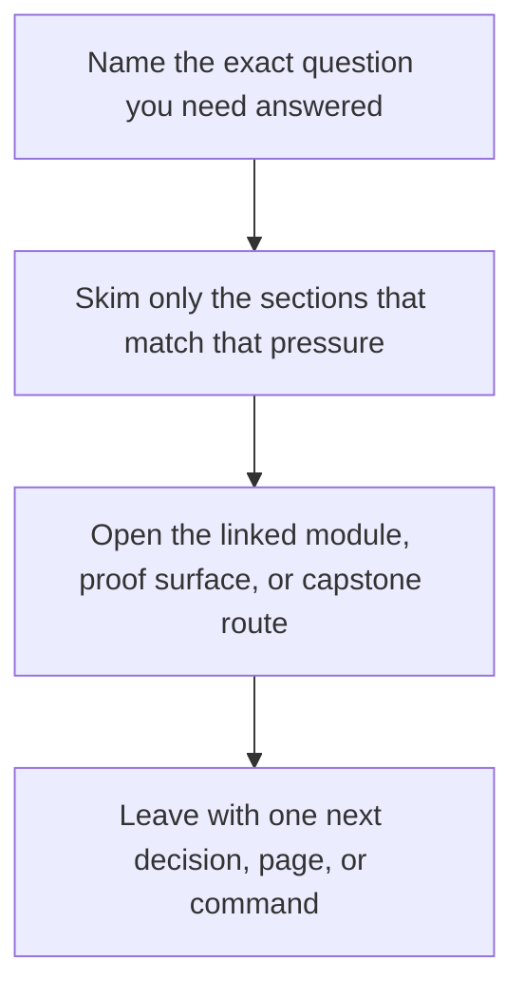

# Capstone Review Worksheet

<!-- page-maps:start -->
## Guide Fit

<!-- page-maps:end -->

Read the first diagram as a timing map: this guide is for a named pressure, not for wandering the whole course-book. Read the second diagram as the guide loop: arrive with a concrete question, use only the matching sections, then leave with one smaller and more honest next move.

Read the first diagram as a timing map: this guide is for a named pressure, not for wandering the whole course-book. Read the second diagram as the guide loop: arrive with a concrete question, use only the matching sections, then leave with one smaller and more honest next move.

Read the first diagram as a timing map: this guide is for a named pressure, not for wandering the whole course-book. Read the second diagram as the guide loop: arrive with a concrete question, use only the matching sections, then leave with one smaller and more honest next move.

Use this worksheet when you want to review the capstone as a build-system specimen rather
than just read it as course material.

---

## Public Surface

Answer these first:

* which targets are clearly public
* which targets are clearly internal
* whether the help text is enough for another maintainer to start correctly

[Back to top](#top)

---

## Truth And Convergence

Review these questions:

* where are hidden inputs modeled
* what would cause non-convergence
* which files or rules are responsible for generated artifacts
* whether `selftest` proves the core invariants clearly enough

[Back to top](#top)

---

## Parallel Safety

Review these questions:

* which outputs have one writer
* which recipes would become unsafe under `-j` if the graph lied
* whether the repro pack covers the main race and ordering classes

[Back to top](#top)

---

## Architecture

Review these questions:

* whether the `mk/*.mk` split is responsibility-driven
* whether macros reduce duplication without hiding graph meaning
* whether discovery, stamps, and contract rules are easy to locate

[Back to top](#top)

---

## Release And Stewardship

Review these questions:

* whether `dist` and `attest` are separated cleanly
* whether portability boundaries are explicit
* whether another maintainer could extend the capstone without weakening its teaching value

[Back to top](#top)
