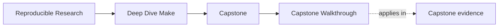
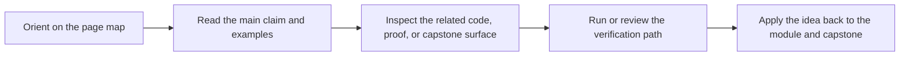

# Capstone Walkthrough

<!-- page-maps:start -->
## Page Maps

<!-- page-maps:end -->

Read the first diagram as a timing map: this page gives the capstone a guided route,
not just a repository map. Read the second diagram as the rule: choose one walkthrough
depth, read the matching guide and artifact, then stop when one honest repository story
is visible.

## First pass versus deeper pass

- First pass: use the 30-minute route when you need one bounded story from public targets to proof.
- Deeper pass: use the longer routes only when the question changes from entry to architecture or stewardship.

## 30-minute first pass

1. Run `make PROGRAM=reproducible-research/deep-dive-make capstone-walkthrough`.
2. Read [Capstone Walkthrough](capstone-walkthrough.md) for the guided route.
3. Run `make PROGRAM=reproducible-research/deep-dive-make inspect`.
4. Read [Command Guide](command-guide.md) for the smallest honest command.
5. Read `capstone/Makefile` and `capstone/tests/run.sh`.
6. Run `make PROGRAM=reproducible-research/deep-dive-make test`.

Goal: leave with a clear picture of what the capstone promises, which targets are public,
and how the build proves more than compilation.

## Architecture pass

Use this only after Modules 06-08.

1. Read [Capstone File Guide](capstone-file-guide.md) before widening into the repository.
2. Follow discovery in `capstone/mk/objects.mk`.
3. Follow modeled hidden inputs in `capstone/mk/stamps.mk`.
4. Trace generated-header production from `capstone/scripts/gen_dynamic_h.py`.
5. From `programs/reproducible-research/deep-dive-make/capstone/`, run `gmake --trace dyn`.

Goal: see how truthful graph modeling survives a repository with layers, generation, and
publication boundaries.

## Stewardship pass

Use this only after Modules 09-10.

1. Read [Command Guide](command-guide.md).
2. Read [Capstone File Guide](capstone-file-guide.md).
3. Review `capstone/mk/*.mk`, `capstone/tests/`, and `capstone/repro/`.
4. Run `make PROGRAM=reproducible-research/deep-dive-make capstone-confirm`.

Goal: judge whether another maintainer could extend, review, or migrate the build
without losing its review honesty.

## Good stopping point

Stop when you can explain one complete repository story:

- the public target you started from
- the build behavior it is supposed to prove
- the file or proof surface that makes that claim inspectable

If you cannot tell that story yet, do not widen the tour. Repeat the smaller pass.
