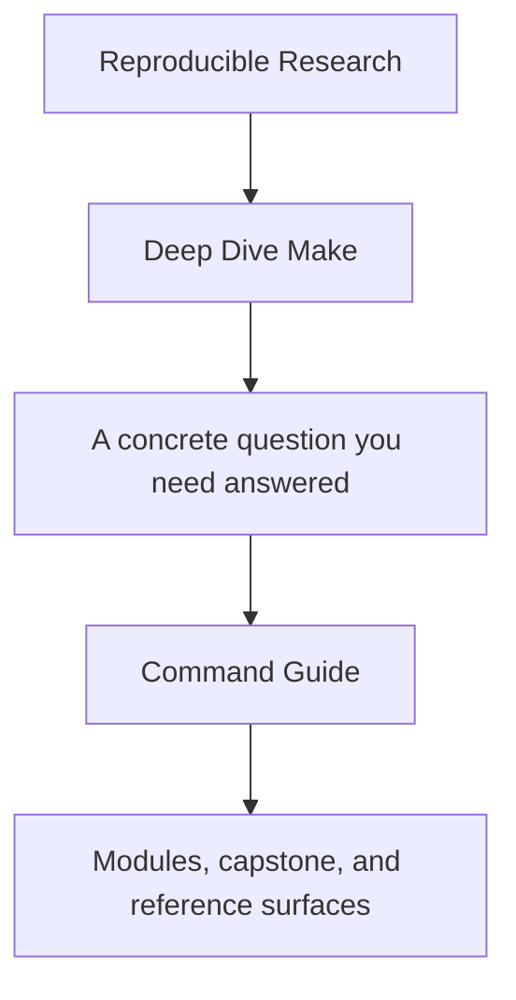
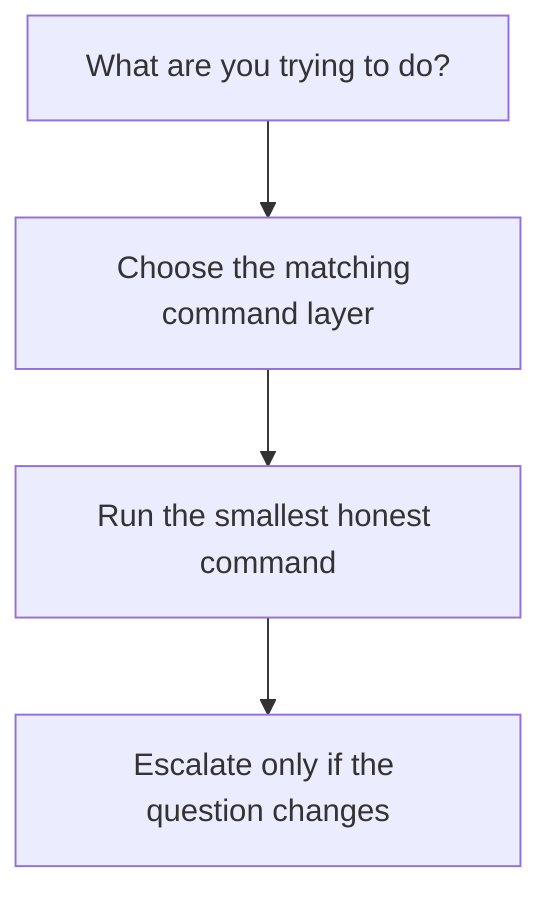

# Command Guide

<!-- page-maps:start -->
## Guide Fit

<!-- page-maps:end -->

Read the first diagram as a timing map: this page is for command choice, not for learning
the whole capstone. Read the second diagram as the rule: choose the command layer that
matches the current job, run the smallest honest command, then escalate only if the
question changes.

Deep Dive Make has three command layers: repository root, program directory, and capstone
directory. The layers exist so you do not have to guess where a command belongs.

## Choose the command layer

| If you need... | Use this layer | Why |
| --- | --- | --- |
| one stable entrypoint from the repository root | repository root | consistent commands across all programs |
| course-local commands while staying inside the program | `programs/reproducible-research/deep-dive-make/` | a smaller surface than the repo root |
| the raw executable reference build | `capstone/` | direct access to the Make build itself |

## Start by job, not by directory

| If the job is... | Start here | Do not start with |
| --- | --- | --- |
| first-pass capstone reading | `make PROGRAM=reproducible-research/deep-dive-make capstone-walkthrough` | `make PROGRAM=reproducible-research/deep-dive-make capstone-confirm` |
| public-contract review | `make PROGRAM=reproducible-research/deep-dive-make inspect` | `make PROGRAM=reproducible-research/deep-dive-make proof` |
| build-system proof | `make PROGRAM=reproducible-research/deep-dive-make test` | `make PROGRAM=reproducible-research/deep-dive-make capstone-discovery-audit` |
| steward-level review | `make PROGRAM=reproducible-research/deep-dive-make proof` | ad hoc jumps into `capstone-contract-audit`, `capstone-profile-audit`, or `capstone-confirm` before you know which stronger route you need |
| strongest final confirmation | `make PROGRAM=reproducible-research/deep-dive-make capstone-confirm` | `make PROGRAM=reproducible-research/deep-dive-make capstone-walkthrough` |

## Repository root

Use root-level commands when you want one entrypoint that works across programs.

- `make PROGRAM=reproducible-research/deep-dive-make capstone-walkthrough`
- `make PROGRAM=reproducible-research/deep-dive-make inspect`
- `make PROGRAM=reproducible-research/deep-dive-make test`
- `make PROGRAM=reproducible-research/deep-dive-make proof`
- `make PROGRAM=reproducible-research/deep-dive-make capstone-confirm`

## Program directory

Use `programs/reproducible-research/deep-dive-make/` when you want the course-local
surface.

- `make capstone-walkthrough`
- `make inspect`
- `make test`
- `make proof`
- `make capstone-confirm`

## Capstone directory

Use `capstone/` when you want the raw reference build. On macOS, use `gmake`.

- `gmake walkthrough`
- `gmake inspect`
- `gmake selftest`
- `gmake verify-report`
- `gmake proof`
- `gmake confirm`

## Good stopping point

Stop when you can explain why the chosen command layer is proportionate to the current
question. If the layer still feels too large, step down one layer before opening more
targets.
