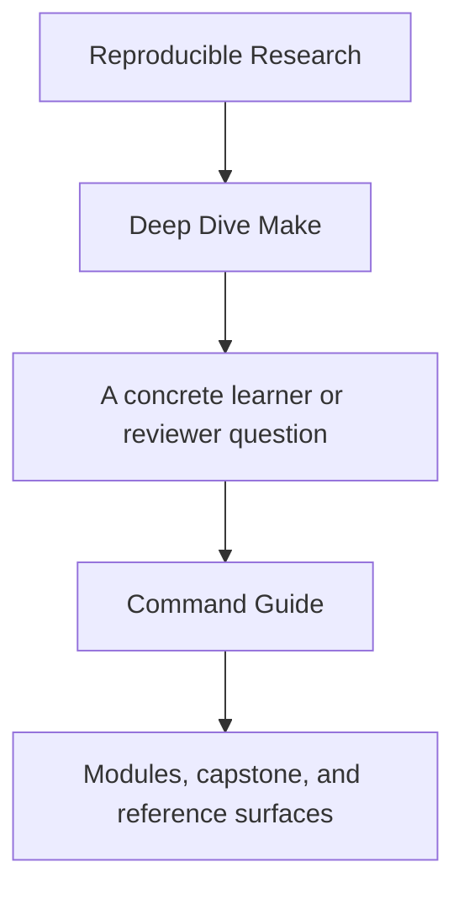
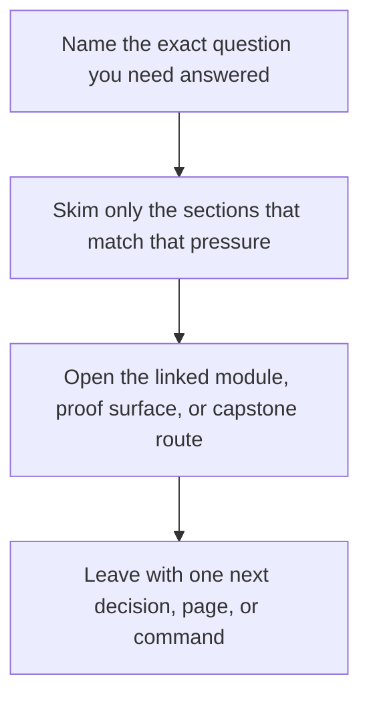

<a id="top"></a>

# Command Guide


<!-- page-maps:start -->
## Guide Fit




<!-- page-maps:end -->

Read the first diagram as a timing map: this guide is for a named pressure, not for wandering the whole course-book. Read the second diagram as the guide loop: arrive with a concrete question, use only the matching sections, then leave with one smaller and more honest next move.

Read the first diagram as a timing map: this guide is for a named pressure, not for wandering the whole course-book. Read the second diagram as the guide loop: arrive with a concrete question, use only the matching sections, then leave with one smaller and more honest next move.

Read the first diagram as a timing map: this guide is for a named pressure, not for wandering the whole course-book. Read the second diagram as the guide loop: arrive with a concrete question, use only the matching sections, then leave with one smaller and more honest next move.

Deep Dive Make has three command layers: repository root, program directory, and capstone
directory. This page makes those boundaries explicit so the learner does not have to guess
where a command belongs.

---

## Repository Root

Use root-level commands when you want one entrypoint that works across programs.

| Command | What it does |
| --- | --- |
| `make PROGRAM=reproducible-research/deep-dive-make test` | run the course's main verification target |
| `make PROGRAM=reproducible-research/deep-dive-make docs-build` | build the course docs in strict mode |
| `make PROGRAM=reproducible-research/deep-dive-make demo` | build the learner-facing capstone walkthrough bundle |
| `make PROGRAM=reproducible-research/deep-dive-make inspect` | build the learner-facing capstone inspection bundle |
| `make PROGRAM=reproducible-research/deep-dive-make capstone-walkthrough` | build the learner-facing walkthrough bundle |
| `make PROGRAM=reproducible-research/deep-dive-make capstone-tour` | print the capstone reading route |
| `make PROGRAM=reproducible-research/deep-dive-make proof` | build the sanctioned learner-facing proof bundle set |
| `make PROGRAM=reproducible-research/deep-dive-make capstone-contract-audit` | build the public-contract review bundle |
| `make PROGRAM=reproducible-research/deep-dive-make capstone-incident-audit` | build the incident review bundle |
| `make PROGRAM=reproducible-research/deep-dive-make capstone-verify-report` | build the selftest verification report bundle |
| `make PROGRAM=reproducible-research/deep-dive-make capstone-profile-audit` | build the execution-profile review bundle |
| `make PROGRAM=reproducible-research/deep-dive-make capstone-confirm` | run the capstone's strongest confirmation route |
| `make PROGRAM=reproducible-research/deep-dive-make program-help` | show the program Makefile surface |

[Back to top](#top)

---

## Program Directory

Use `programs/reproducible-research/deep-dive-make/` when you want the course-local
surface.

| Command | What it does |
| --- | --- |
| `make help` | show program-level targets |
| `make test` | run the capstone selftest via the program surface |
| `make demo` | build the learner-facing capstone walkthrough bundle |
| `make inspect` | build the learner-facing capstone inspection bundle |
| `make capstone-walkthrough` | build the learner-facing walkthrough bundle |
| `make capstone-tour` | print the capstone reading route |
| `make proof` | build the sanctioned learner-facing proof bundle set |
| `make capstone-verify-report` | build the selftest verification report bundle |
| `make capstone-profile-audit` | build the execution-profile review bundle |
| `make capstone-confirm` | run the capstone's strongest confirmation route |
| `make capstone-hardened` | run the strongest built-in capstone verification |
| `make clean` | clear program and capstone artifacts |

[Back to top](#top)

---

## Capstone Directory

Use `capstone/` when you want the raw executable reference build.

| Command | What it does |
| --- | --- |
| `gmake help` | show public capstone targets on macOS |
| `gmake inspect` | build the learner-facing inspection bundle |
| `gmake walkthrough` | build the learner-facing walkthrough bundle |
| `gmake tour` | print the recommended reading route |
| `gmake selftest` | run convergence, equivalence, and negative checks |
| `gmake verify-report` | write the selftest verification report bundle |
| `gmake proof` | write the sanctioned learner-facing proof bundle set |
| `gmake selftest-report` | write the selftest verification report bundle |
| `gmake profile-audit` | write the execution-profile review bundle |
| `gmake confirm` | run the strongest capstone confirmation route |
| `gmake hardened` | run the strongest capstone validation set |
| `gmake repro` | list the failure-mode repro pack |

[Back to top](#top)

---

## Best Defaults by Module Arc

Use the smallest honest route for the part of the course you are in:

| Module arc | Start with | Then use |
| --- | --- | --- |
| Modules 01-02 | `make PROGRAM=reproducible-research/deep-dive-make capstone-walkthrough` | `make PROGRAM=reproducible-research/deep-dive-make test` |
| Modules 03-05 | `make PROGRAM=reproducible-research/deep-dive-make inspect` | `make PROGRAM=reproducible-research/deep-dive-make capstone-verify-report` |
| Modules 06-09 | `make PROGRAM=reproducible-research/deep-dive-make proof` | `make PROGRAM=reproducible-research/deep-dive-make capstone-profile-audit` |
| Module 10 | `make PROGRAM=reproducible-research/deep-dive-make capstone-confirm` | `gmake -C capstone repro` |

If you are reviewing the capstone deeply:

```sh
gmake -C capstone help
gmake -C capstone inspect
gmake -C capstone verify-report
gmake -C capstone proof
gmake -C capstone confirm
gmake -C capstone repro
```

[Back to top](#top)
