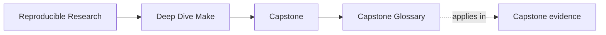
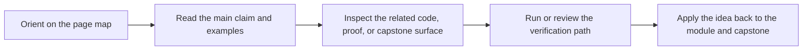

# Capstone Glossary

<!-- page-maps:start -->
## Page Maps

<!-- page-maps:end -->

Use this page when the Deep Dive Make capstone routes start sounding interchangeable.
The goal is to keep the build reviewable under pressure instead of relying on oral
history or terminal folklore.

| Term | Meaning here |
| --- | --- |
| walkthrough | the bounded first pass through the repository before stronger proof routes |
| public target | a supported target review and maintenance work can rely on |
| proof route | the command or saved bundle that corroborates a build claim instead of merely asserting it |
| convergence | the property that the build reaches the same honest end state rather than drifting through leftovers |
| parallel safety | the property that `-j` does not introduce races, shared-writer corruption, or hidden ordering assumptions |
| repro | a deliberately broken miniature Makefile that isolates one failure class cleanly |
| stewardship review | the stronger route used when another maintainer needs to judge the repository as a specimen |
| release residue | build leftovers or local evidence that must not masquerade as publishable source |
