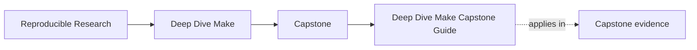

# Deep Dive Make Capstone Guide

<!-- page-maps:start -->
## Page Maps

<!-- page-maps:end -->

This capstone is the executable reference build for Deep Dive Make. It keeps graph truth,
atomic publication, parallel safety, determinism, and self-testing in one compact
repository so the course can point to real evidence instead of slogans.

Use this guide once the local module idea is already legible. The capstone should answer
one build question at a time, not become a full repository tour by default.

## What this capstone proves

- public targets can stay small and stable
- graph truth can survive hidden-input and generated-file pressure
- serial and parallel execution can agree when the build deserves trust
- failure specimens can stay isolated and teachable without polluting the healthy build

## Choose the right capstone route

| If your question is... | Best page |
| --- | --- |
| Which capstone surface matches the current module? | [Capstone Map](capstone-map.md) |
| Which targets or commands are public? | [Command Guide](command-guide.md) |
| Which files own the build behavior? | [Capstone File Guide](capstone-file-guide.md) |
| Where do contract, graph, proof, and repro ownership live? | [Capstone Architecture Guide](capstone-architecture-guide.md) |
| Which proof route is honest for this claim? | [Capstone Proof Guide](capstone-proof-guide.md) |
| How should I review the repository as a steward? | [Capstone Review Worksheet](capstone-review-worksheet.md) |
| Where should a new change land? | [Capstone Extension Guide](capstone-extension-guide.md) |

## Start by module range

| Module range | Best capstone focus |
| --- | --- |
| Modules 01-02 | truthful edges, atomic publication, and one explainable race condition |
| Modules 03-05 | selftests, public targets, portability, and hidden-input proof |
| Modules 06-08 | generator boundaries, layered `mk/` design, and release surfaces |
| Modules 09-10 | incident review, stewardship judgment, and extension pressure |

## Core commands

| If you need... | From the repository root | From the capstone directory |
| --- | --- | --- |
| the first bounded pass | `make PROGRAM=reproducible-research/deep-dive-make capstone-walkthrough` | `gmake walkthrough` |
| public-contract review | `make PROGRAM=reproducible-research/deep-dive-make inspect` | `gmake inspect` |
| the steward-level proof route | `make PROGRAM=reproducible-research/deep-dive-make proof` | `gmake proof` |

On macOS, use `gmake` inside `capstone/` because `/usr/bin/make` is BSD Make.

## Guide set

- [Capstone Map](capstone-map.md)
- [Capstone Walkthrough](capstone-walkthrough.md)
- [Command Guide](command-guide.md)
- [Capstone File Guide](capstone-file-guide.md)
- [Capstone Architecture Guide](capstone-architecture-guide.md)
- [Capstone Proof Guide](capstone-proof-guide.md)
- [Capstone Review Worksheet](capstone-review-worksheet.md)
- [Capstone Extension Guide](capstone-extension-guide.md)
- [Glossary](glossary.md)

## Review questions

- Which targets are truly public, and which are only helper surfaces?
- Which file proves convergence and parallel safety instead of merely claiming them?
- Which failure class is the healthy build defending against right now?

## Stop here when

- you know the current build claim in plain language
- you know the smallest file, guide, or command that can prove it
- you know whether a wider steward review is actually necessary
