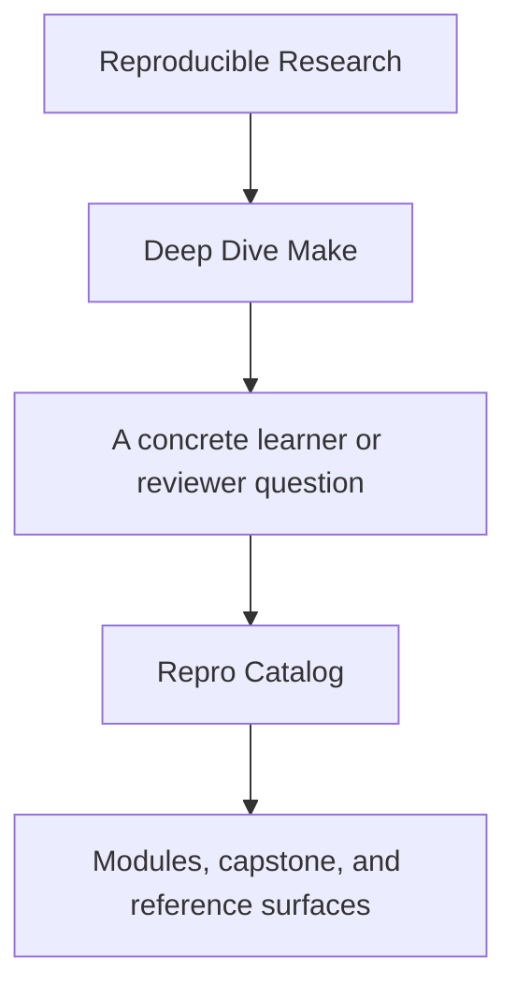
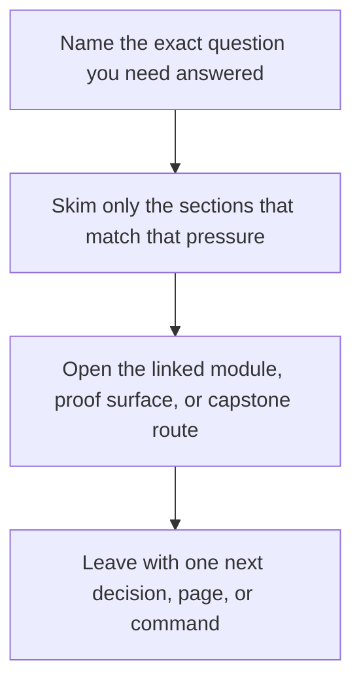

# Repro Catalog

<!-- page-maps:start -->
## Guide Fit

<!-- page-maps:end -->

Read the first diagram as a timing map: this guide is for a named pressure, not for wandering the whole course-book. Read the second diagram as the guide loop: arrive with a concrete question, use only the matching sections, then leave with one smaller and more honest next move.

The repro pack should teach failure classes, not just contain small Makefiles.

This catalog names each repro, explains what it demonstrates, and points to the first
question the learner should ask when running it.

---

## Repro Pack Overview

| Repro | Failure class | First question |
| --- | --- | --- |
| `01-shared-log.mk` | shared mutable output under concurrency | "Why are two recipes writing to one file?" |
| `01-shared-append.mk` | compatibility alias for the same lesson | "Am I reading older material or the canonical name?" |
| `02-temp-collision.mk` | non-atomic publication and temp-file discipline | "What temp file names or publication steps are unsafe?" |
| `03-stamp-clobber.mk` | dishonest stamp usage | "What input or boundary is the stamp pretending to model?" |
| `04-generated-header.mk` | generated-file boundary mistakes | "Is the generated file modeled as a real graph node?" |
| `05-mkdir-race.mk` | directory creation races | "Why does directory setup need to be idempotent?" |
| `06-order-only-misuse.mk` | misunderstanding order-only prerequisites | "Which edge should affect staleness rather than just sequencing?" |
| `07-pattern-ambiguity.mk` | rule selection ambiguity | "Which rule does Make pick, and why?" |

[Back to top](#top)

---

## Best Order To Study Them

1. `01-shared-log.mk`
2. `05-mkdir-race.mk`
3. `06-order-only-misuse.mk`
4. `03-stamp-clobber.mk`
5. `04-generated-header.mk`
6. `07-pattern-ambiguity.mk`
7. `02-temp-collision.mk`

This order moves from visible concurrency hazards into subtler modeling and selection
problems.

[Back to top](#top)

---

## How To Use A Repro Well

For each repro:

1. predict the failure before you run it
2. run it with the relevant command
3. describe the defect class in words
4. state the repair pattern before you implement anything

Best first questions:

* `01-shared-log.mk`: why are two recipes writing to the same output surface?
* `05-mkdir-race.mk`: why is directory creation a correctness concern under `-j`?
* `06-order-only-misuse.mk`: which edge should affect staleness rather than only sequencing?

If you only run the Makefile and shrug at the result, the repro did not teach enough.

[Back to top](#top)

---

## Companion Pages

The most useful companion pages for the repro pack are:

* [`capstone-map.md`](capstone-map.md)
* [`capstone-file-guide.md`](capstone-file-guide.md)
* [`incident-ladder.md`](../reference/incident-ladder.md)

[Back to top](#top)
