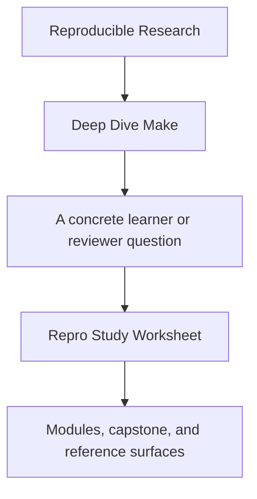
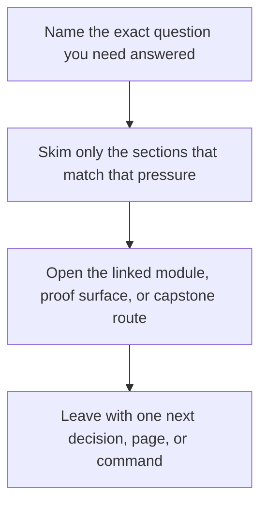

# Repro Study Worksheet

<!-- page-maps:start -->
## Guide Fit

<!-- page-maps:end -->

Read the first diagram as a timing map: this guide is for a named pressure, not for wandering the whole course-book. Read the second diagram as the guide loop: arrive with a concrete question, use only the matching sections, then leave with one smaller and more honest next move.

Use this worksheet when running the capstone repro pack. The goal is not only to trigger
the failure. The goal is to explain it well enough that you could repair the graph or
publication boundary deliberately.

---

## Before You Run The Repro

Write down:

1. which file you are about to run
2. what failure class it is supposed to teach
3. what you predict will go wrong under `-j` or under the current graph

[Back to top](#top)

---

## While You Run It

Capture:

1. the exact command you ran
2. the visible symptom
3. whether the failure is about graph truth, publication, directory setup, or rule choice

[Back to top](#top)

---

## After You See The Failure

Answer these:

1. what is the real defect class
2. which edge, target, or publication step is lying
3. what repair pattern would remove the defect
4. which course module teaches the healthy version of this idea

[Back to top](#top)

---

## Best First Repros

Use this order for a first serious repro pass:

1. `repro/01-shared-log.mk`
2. `repro/05-mkdir-race.mk`
3. `repro/06-order-only-misuse.mk`

That route moves from visible parallel corruption into subtler graph-boundary mistakes.

[Back to top](#top)

---

## Best Companion Pages

Use these pages with this worksheet:

* [`repro-catalog.md`](repro-catalog.md)
* [`incident-ladder.md`](../reference/incident-ladder.md)
* [`proof-matrix.md`](../guides/proof-matrix.md)

[Back to top](#top)
