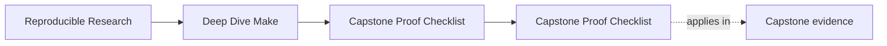
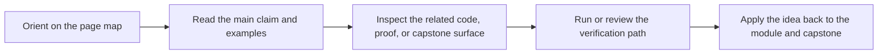

# Capstone Proof Checklist

<!-- page-maps:start -->
## Page Maps

<!-- page-maps:end -->

Use this checklist when you want one bounded end-to-end pass through the capstone without
turning the experience into random file browsing.

---

## Enter This Checklist At The Right Time

Use this full checklist after Module 03. Before that point, prefer the smaller
`capstone-walkthrough` route so the capstone stays a corroboration surface rather than a
replacement for the local exercises.

If you are in Modules 06-10, this checklist becomes the baseline review route before
incident audits, profile audits, or the final confirmation path.

[Back to top](#top)

---

## First Pass

Work through these in order:

1. run `gmake -C capstone help`
2. run `make PROGRAM=reproducible-research/deep-dive-make proof`
3. read the capstone's local [`TARGET_GUIDE.md`](https://github.com/bijux/bijux-masterclass/blob/master/programs/reproducible-research/deep-dive-make/capstone/TARGET_GUIDE.md)
4. read `capstone/Makefile` and `capstone/tests/run.sh`
5. inspect `artifacts/proof/reproducible-research/deep-dive-make/selftest/`
6. inspect `artifacts/audit/reproducible-research/deep-dive-make/contract/`
7. inspect `artifacts/audit/reproducible-research/deep-dive-make/incident/`
8. inspect `artifacts/audit/reproducible-research/deep-dive-make/profile/`
9. run `gmake -C capstone repro`

Goal: confirm that the repository has a public API, a proof harness, and explicit failure
teaching material.

[Back to top](#top)

---

## What You Should Be Able To Answer

At the end of the checklist, you should be able to answer:

* what `selftest` proves
* where the sanctioned proof bundle set is written
* where the profile review bundle fits into the proof route
* where hidden inputs are modeled
* where generated files enter the graph
* which target another engineer should call first
* which repro file teaches a real race or ordering defect

[Back to top](#top)

---

## Best Follow-Up Routes

If you want more depth after the checklist:

* use [`capstone-file-guide.md`](capstone-file-guide.md) for file responsibilities
* use [`proof-matrix.md`](proof-matrix.md) for claim-to-evidence routing
* use [`repro-catalog.md`](repro-catalog.md) for failure-class study

[Back to top](#top)
