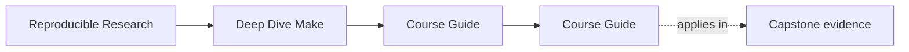
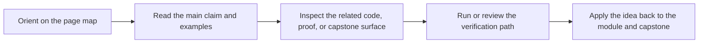

<a id="top"></a>

# Course Guide


<!-- page-maps:start -->
## Page Maps




<!-- page-maps:end -->

Deep Dive Make now has enough supporting material that learners need one stable hub for
choosing the right page quickly.

This guide groups the course surfaces by the question you are trying to answer.

---

## If You Are New Here

Start with these pages in order:

1. [`start-here.md`](start-here.md)
2. [`platform-setup.md`](platform-setup.md)
3. [`module-00.md`](../module-00-orientation/index.md)
4. [`learning-contract.md`](learning-contract.md)
5. [`module-dependency-map.md`](../reference/module-dependency-map.md)

Then begin Module 01.

[Back to top](#top)

---

## If You Need A Stable Reference

Use these pages when you already know the course but need a fast answer:

* [`build-graph-glossary.md`](../reference/build-graph-glossary.md) for shared vocabulary
* [`concept-index.md`](../reference/concept-index.md) for where an idea is taught
* [`command-guide.md`](command-guide.md) for root, program, and capstone surfaces
* [`proof-matrix.md`](proof-matrix.md) for claim-to-evidence routing
* [`practice-map.md`](../reference/practice-map.md) for the right proof loop
* [`public-targets.md`](../reference/public-targets.md) for stable command surfaces
* [`incident-ladder.md`](../reference/incident-ladder.md) for debugging order

[Back to top](#top)

---

## If You Need The Capstone

Use these pages when the course concept is already legible and you want the executable
reference build:

* [`capstone-map.md`](capstone-map.md) for module-to-repository routing
* [`capstone-file-guide.md`](capstone-file-guide.md) for file responsibilities
* [`capstone-proof-checklist.md`](capstone-proof-checklist.md) for one bounded proof pass
* [`capstone-walkthrough.md`](capstone-walkthrough.md) for bounded reading routes
* [`repro-catalog.md`](repro-catalog.md) for failure-mode examples
* [`capstone-extension-guide.md`](capstone-extension-guide.md) for safe evolution

[Back to top](#top)

---

## If You Are Reviewing The Course

Use these pages when you care about assessment, maintainability, or repository review:

* [`completion-rubric.md`](../reference/completion-rubric.md)
* [`module-dependency-map.md`](../reference/module-dependency-map.md)
* [`proof-matrix.md`](proof-matrix.md)
* [`public-targets.md`](../reference/public-targets.md)
* [`capstone-review-worksheet.md`](capstone-review-worksheet.md)
* [`capstone-extension-guide.md`](capstone-extension-guide.md)

[Back to top](#top)

---

## Best Three Entry Commands

```sh
make PROGRAM=reproducible-research/deep-dive-make capstone-walkthrough
make PROGRAM=reproducible-research/deep-dive-make test
make PROGRAM=reproducible-research/deep-dive-make capstone-tour
gmake -C capstone help
```

Use `gmake` on macOS, where `/usr/bin/make` is not GNU Make 4.3+.

[Back to top](#top)
