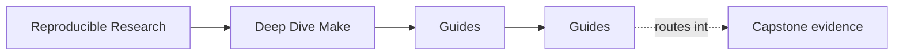
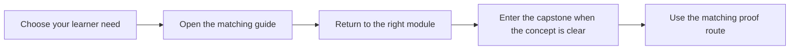

# Guides

<!-- page-maps:start -->
## Page Maps

<!-- page-maps:end -->

The guides surface holds the learner routes for Deep Dive Make. Use these pages when you
need entry points, learning order, command choice, capstone reading order, or review
worksheets rather than a single durable definition.

Use them in this order when you are new to the program:

1. [Start Here](start-here.md)
2. [Course Guide](course-guide.md)
3. [Learning Contract](learning-contract.md)
4. [Module 00: Orientation and Study Strategy](../module-00-orientation/index.md)
5. the ten module directories in order

## Start With These Pages

- [Start Here](start-here.md) if you need the right entry path
- [Course Guide](course-guide.md) if you want the fastest route to the right support page
- [Learning Contract](learning-contract.md) if you want the pedagogical boundaries first
- [Module Promise Map](module-promise-map.md) if you want each module title translated into an explicit learner contract
- [Module Checkpoints](module-checkpoints.md) if you want a module-end readiness bar before moving on
- [Platform Setup](platform-setup.md) if you plan to run the proof surfaces locally

## Proof And Navigation Guides

- [Command Guide](command-guide.md) for root, program, and capstone command boundaries
- [Proof Matrix](proof-matrix.md) for claim-to-evidence routing
- [Capstone Map](capstone-map.md) for module-to-repository routing
- [Capstone File Guide](capstone-file-guide.md) for file responsibilities
- [Capstone Walkthrough](capstone-walkthrough.md) for a bounded first reading route

## Capstone Review Guides

- [Capstone Project](readme-capstone.md) for the repository contract
- [Capstone Proof Checklist](capstone-proof-checklist.md) for a bounded proof pass
- [Capstone Review Worksheet](capstone-review-worksheet.md) for structured repository review
- [Repro Catalog](repro-catalog.md) for failure-mode examples
- [Repro Study Worksheet](repro-study-worksheet.md) for guided failure analysis
- [Capstone Extension Guide](capstone-extension-guide.md) for safe evolution
