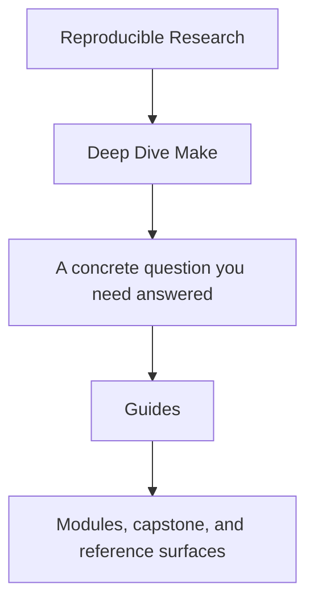
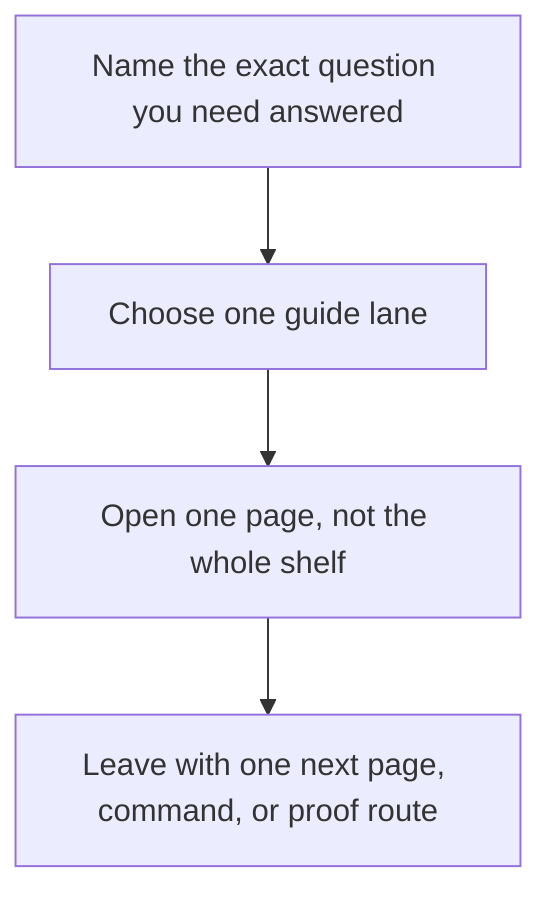

# Guides

<!-- page-maps:start -->
## Guide Fit

<!-- page-maps:end -->

Read the first diagram as a timing map: the guides shelf is for a named pressure, not for
wandering the whole course-book. Read the second diagram as the guide loop: choose one
lane, use one page, then leave with one smaller next move.

Use this shelf when you need route choice, proof sizing, or capstone entry help rather
than one module chapter.

## Choose one lane

| If you need... | Start here | Then use |
| --- | --- | --- |
| the shortest honest entry | [Start Here](start-here.md) | [Course Guide](course-guide.md) |
| the full support-page map | [Course Guide](course-guide.md) | [Learning Contract](learning-contract.md) |
| a route shaped by urgency | [Pressure Routes](pressure-routes.md) | [Proof Ladder](proof-ladder.md) |
| module promises and exit bars | [Module Promise Map](module-promise-map.md) | [Module Checkpoints](module-checkpoints.md) |
| proof selection | [Proof Ladder](proof-ladder.md) | [Proof Matrix](proof-matrix.md) |
| capstone entry | [Capstone Guide](../capstone/index.md) | [Capstone Map](../capstone/capstone-map.md) |

## Use the shelf by job

| Job | Best page |
| --- | --- |
| understand the module arc and support-page roles | [Course Guide](course-guide.md) |
| see the sequence justified | [Module Dependency Map](../reference/module-dependency-map.md) |
| rehearse the module-to-proof loop | [Practice Map](../reference/practice-map.md) |
| hold the stable review bar steady | [Review Checklist](../reference/review-checklist.md) |
| sharpen a keep, change, or reject boundary call | [Boundary Review Prompts](../reference/boundary-review-prompts.md) |
| spot common failure classes faster | [Anti-Pattern Atlas](../reference/anti-pattern-atlas.md) |
| route a claim to executable evidence | [Proof Matrix](proof-matrix.md) |
| choose the smallest honest proof route | [Proof Ladder](proof-ladder.md) |
| confirm the local environment before public commands | [Platform Setup](platform-setup.md) |

## Cross into the capstone deliberately

| If you need... | Best page |
| --- | --- |
| the capstone's role in the course | [Capstone](../capstone/index.md) |
| the module-to-repository route | [Capstone Map](../capstone/capstone-map.md) |
| a bounded first pass through the repository | [Capstone Walkthrough](../capstone/capstone-walkthrough.md) |
| file responsibilities inside the repository | [Capstone File Guide](../capstone/capstone-file-guide.md) |
| ownership boundaries across graph, proof, and release surfaces | [Capstone Architecture Guide](../capstone/capstone-architecture-guide.md) |
| one end-to-end proof pass | [Capstone Proof Guide](../capstone/capstone-proof-guide.md) |
| steward-level review | [Capstone Review Worksheet](../capstone/capstone-review-worksheet.md) |
| safe evolution | [Capstone Extension Guide](../capstone/capstone-extension-guide.md) |

## Good stopping point

Stop when you can name the single next page you need and the question it is supposed to
answer. If you are still opening whole shelves, go back to the table above and choose a
smaller lane.

## Shelf vocabulary

Use this section when the support shelf starts sounding more abstract than the course
intends. The goal is not to add theory. The goal is to keep a small set of terms stable
so you can move between `guides/`, the modules, and the capstone without quietly
changing what a word means.

### Terms that matter on this shelf

| Term | Meaning here | Why it matters |
| --- | --- | --- |
| reading route | a short, deliberate reading path for one question | prevents wandering through five pages when one page would do |
| pressure | the concrete situation shaping how you read right now | keeps the guides tied to real use instead of generic study advice |
| proof route | the smallest command, file, or bundle that can honestly answer the current claim | keeps evidence proportional to the question |
| support shelf | the `guides/` directory as a whole | reminds you these pages are helpers, not substitute chapters |
| module promise | the practical contract a module is supposed to deliver | helps you judge whether a module actually taught what its title implies |
| checkpoint | the readiness bar for moving on from a module | stops recognition from masquerading as understanding |
| capstone entry | the first bounded route into the executable repository | keeps the capstone from becoming first-contact reading |
| bounded review | an inspection pass with a clear stopping point | keeps review from growing into unstructured browsing |

### Guide names in plain language

| Page | What it is for |
| --- | --- |
| [Start Here](start-here.md) | first entry when you need the safest route into the course |
| [Course Guide](course-guide.md) | overview of when to use modules, guides, capstone pages, or reference maps |
| [Learning Contract](learning-contract.md) | the bar the course sets for explanation, proof, and honest progress |
| [Module Promise Map](module-promise-map.md) | translation of module titles into the outcomes you should reach |
| [Module Checkpoints](module-checkpoints.md) | readiness review before you move on |
| [Platform Setup](platform-setup.md) | tooling and command boundary checks before you rely on local results |
| [Proof Ladder](proof-ladder.md) | how to choose a smaller or larger proof route without guessing |
| [Proof Matrix](proof-matrix.md) | where a specific claim is first corroborated |
| [Pressure Routes](pressure-routes.md) | shortest route when urgency, repair work, or stewardship is shaping the reading order |

## Reading rule

If a guide name still sounds fuzzy after you read the table above, do not open three more
guides. Pick the page whose question most closely matches yours, use it, and stop when
you have one clear next move.
