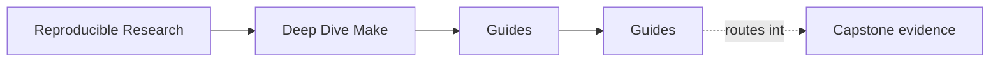
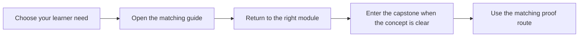

# Guides

<!-- page-maps:start -->
## Page Maps

<!-- page-maps:end -->

The guides surface holds the learner routes for Deep Dive Make. Use these pages when you
need study order, command routing, proof selection, or capstone reading help rather than
one module chapter.

## Read These First

- [Start Here](start-here.md) for the shortest honest entry route
- [Course Guide](course-guide.md) for the full module arc and support-page roles
- [Learning Contract](learning-contract.md) for the teaching bar and proof expectations
- [Module 00: Orientation and Study Strategy](../module-00-orientation/index.md) for the full course shape
- [Platform Setup](platform-setup.md) before you run local proof commands

## Use These For Study Planning

- [Pressure Routes](pressure-routes.md) when your route is shaped by repair, stewardship, or incident pressure
- [Module Promise Map](module-promise-map.md) when you want each module title translated into a learner contract
- [Module Checkpoints](module-checkpoints.md) when you want a module-end exit bar before moving on
- [Module Dependency Map](../reference/module-dependency-map.md) when you need the safe reading order explained
- [Practice Map](../reference/practice-map.md) when you want the module-to-proof loop in one place

## Use These For Commands And Proof

- [Command Guide](command-guide.md) for root, program, and capstone command boundaries
- [Proof Ladder](proof-ladder.md) for choosing the smallest honest proof route
- [Proof Matrix](proof-matrix.md) for routing a claim to the right evidence surface
- [Public Targets](../reference/public-targets.md) when you need the stable command surface
- [Incident Ladder](../reference/incident-ladder.md) when you are debugging under pressure

## Use These For Capstone Reading

- [Capstone Guide](readme-capstone.md) for the repository contract
- [Capstone Map](capstone-map.md) for module-to-repository routing
- [Capstone File Guide](capstone-file-guide.md) for file responsibilities
- [Capstone Walkthrough](capstone-walkthrough.md) for a bounded first reading route
- [Capstone Proof Checklist](capstone-proof-checklist.md) for one proof pass
- [Capstone Review Worksheet](capstone-review-worksheet.md) for structured repository review
- [Repro Catalog](repro-catalog.md) for failure-mode examples
- [Repro Study Worksheet](repro-study-worksheet.md) for guided failure analysis
- [Capstone Extension Guide](capstone-extension-guide.md) for safe evolution

## Keep The Layout Stable

- `index.md` stays the course home
- `guides/` stays the learner route and proof shelf
- `reference/` stays the durable map and glossary shelf
- `module-00-orientation/` plus Modules `01` to `10` stay the teaching arc
