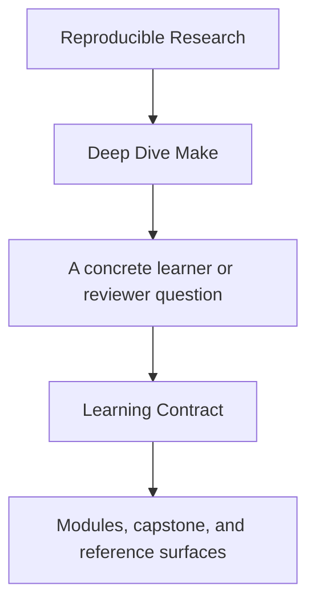
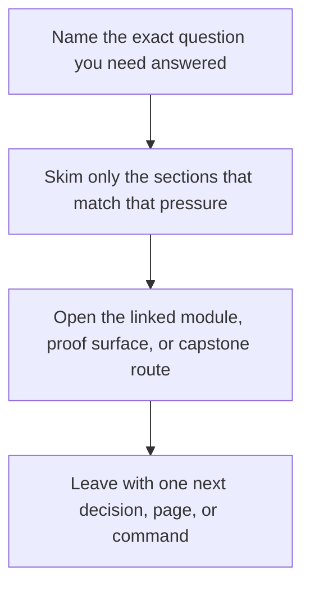

# Learning Contract

<!-- page-maps:start -->
## Guide Fit

<!-- page-maps:end -->

Read the first diagram as a timing map: this guide is for a named pressure, not for wandering the whole course-book. Read the second diagram as the guide loop: arrive with a concrete question, use only the matching sections, then leave with one smaller and more honest next move.

Read the first diagram as a timing map: this guide is for a named pressure, not for wandering the whole course-book. Read the second diagram as the guide loop: arrive with a concrete question, use only the matching sections, then leave with one smaller and more honest next move.

Read the first diagram as a timing map: this guide is for a named pressure, not for wandering the whole course-book. Read the second diagram as the guide loop: arrive with a concrete question, use only the matching sections, then leave with one smaller and more honest next move.

Deep Dive Make is designed around one rule: every important claim should be checkable with
commands, file inspection, or a controlled failure.

This page makes that contract explicit so the learner always knows what the course expects
and how each module should be used.

---

## The Teaching Sequence

Every serious concept in this course should follow this order:

1. concept
2. semantics
3. failure signature
4. minimal repro
5. repair pattern
6. proof command

If a section skips directly from concept to advice, it is incomplete by this course's own
standard.

[Back to top](#top)

---

## The Learner's Responsibility

Your job is not to agree with the prose. Your job is to verify it.

For each module, you should be able to answer:

* what changed in the graph
* why Make decided to rebuild or skip work
* what defect would appear if an edge or publication boundary were wrong
* which command proves the fix instead of merely asserting it

[Back to top](#top)

---

## The Instructor's Responsibility

The course material should always provide:

* a clear concept boundary
* a runnable proof loop
* an explanation of the likely failure mode
* a reason the capstone is or is not the right teaching surface yet

When material does not supply those, the learner has to reconstruct the pedagogy alone.
That is a course design failure, not a learner failure.

[Back to top](#top)

---

## Proof Tools You Should Use Constantly

These commands appear throughout the course because they explain different parts of Make's
behavior:

| Command | What it proves |
| --- | --- |
| `make -n <target>` | what Make intends to run |
| `make --trace <target>` | why each target ran |
| `make -p` | the evaluated rule and variable world |
| `make -q <target>` | whether the graph is converged |
| `make -jN <target>` | whether the graph stays truthful under concurrency |

[Back to top](#top)

---

## When To Use The Capstone

Use the capstone when a concept is already legible in a smaller example and you want to
see how the same idea behaves in a realistic reference build.

Do not use the capstone:

* as your first exposure to a topic
* as a substitute for a minimal repro
* as evidence that you understand a concept you still cannot explain on a smaller graph

Use [`capstone/capstone-map.md`](../capstone/capstone-map.md) when you need a guided route through the
repository.

[Back to top](#top)

---

## Definition Of Done For A Module

A module is complete only when you can:

* run its core proof loop without guessing
* explain one representative defect and repair path
* connect the local exercise to the capstone intentionally
* state which public targets or files matter for that concept

If you can only repeat terminology, the module is not done yet.

[Back to top](#top)
