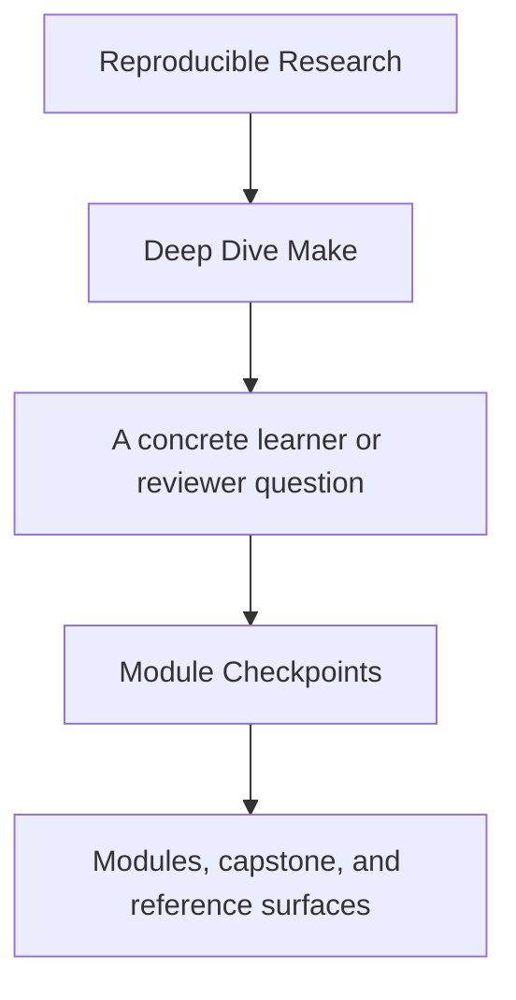
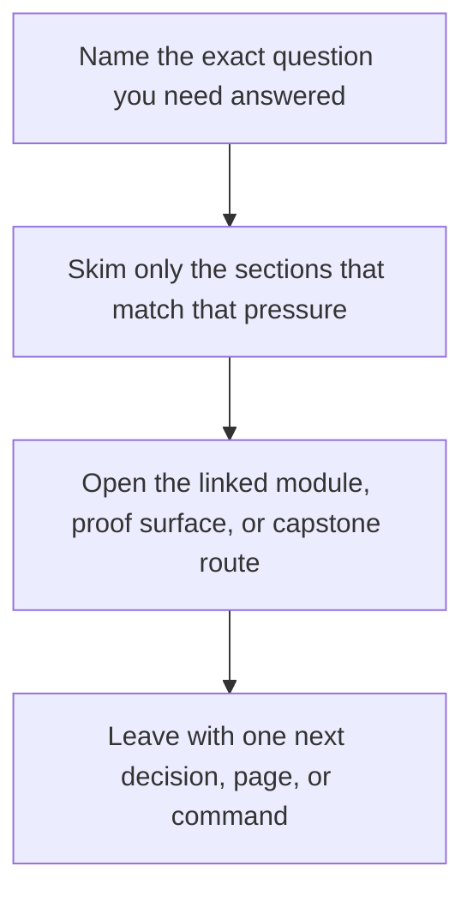

# Module Checkpoints

<!-- page-maps:start -->
## Guide Fit

<!-- page-maps:end -->

Read the first diagram as a timing map: this guide is for a named pressure, not for wandering the whole course-book. Read the second diagram as the guide loop: arrive with a concrete question, use only the matching sections, then leave with one smaller and more honest next move.

Read the first diagram as a timing map: this guide is for a named pressure, not for wandering the whole course-book. Read the second diagram as the guide loop: arrive with a concrete question, use only the matching sections, then leave with one smaller and more honest next move.

Read the first diagram as a timing map: this guide is for a named pressure, not for wandering the whole course-book. Read the second diagram as the guide loop: arrive with a concrete question, use only the matching sections, then leave with one smaller and more honest next move.

This page is the missing study contract at the end of each module. It gives a human bar
for readiness instead of assuming that reading the prose once means the concept is stable.

Use it when you are about to move on and want to know whether you are ready, what you are
still fuzzy on, and which proof route should settle the question.

---

## How To Use The Checkpoints

For each module:

1. read the module overview and main lessons
2. answer the checkpoint questions without looking at the text
3. run the smallest honest proof route
4. only advance when the concept feels explainable, not merely recognizable

[Back to top](#top)

---

## Checkpoint Table

| Module | You are ready when you can explain | You should be able to do | Useful proof route |
| --- | --- | --- | --- |
| 01 | why Make is a graph and not a shell script with decoration | explain a rebuild using prerequisites and timestamps | `capstone-walkthrough` |
| 02 | why `-j` reveals hidden truth problems | name one race class and repair it honestly | `test` |
| 03 | why selftests and public targets are part of the build contract | distinguish build proof from runtime checks | `capstone-verify-report` |
| 04 | how precedence, includes, and rule semantics change debugging | use `make --trace` and `make -p` with less guessing | `capstone-tour` |
| 05 | why hardening means declaring boundaries | name which assumptions belong in policy rather than folklore | `capstone-contract-audit` |
| 06 | how generators and multi-output rules distort truth if modeled loosely | trace a generated artifact back to its real inputs | `proof` |
| 07 | why layered includes should clarify ownership instead of hiding it | point to the owning file for one structural change | `inspect` |
| 08 | what makes a published artifact trustworthy | explain the difference between a built output and a reviewed release surface | `proof` |
| 09 | how to move from build symptom to responsible boundary | choose the right diagnostic route before random debugging | `capstone-incident-audit` |
| 10 | when Make is still the right owner and when it is not | review a build as a long-lived product with migration judgment | `capstone-confirm` |

[Back to top](#top)

---

## Failure Signals

Do not advance yet if any of these are still true:

* you can recognize the term but cannot explain the invariant it protects
* you know the strongest proof command but not the smallest honest one
* you can follow the capstone mechanically but cannot name the owning boundary
* you can repeat the repair pattern but cannot say what failure it prevents

These are not minor study gaps. They are signals that the next module will feel more
arbitrary than it should.

[Back to top](#top)

---

## Best Companion Pages

Use these with the checkpoints:

* [`module-promise-map.md`](module-promise-map.md) to see what each title promised
* [`proof-ladder.md`](proof-ladder.md) to keep proof proportional to the question
* [`practice-map.md`](../reference/practice-map.md) to match module work with proof loops
* [`capstone-review-worksheet.md`](../capstone/capstone-review-worksheet.md) when you want to record what the evidence actually showed

[Back to top](#top)
