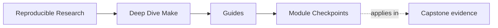
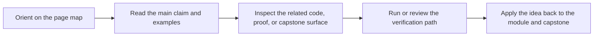

# Module Checkpoints

<!-- page-maps:start -->
## Page Maps

<!-- page-maps:end -->

Use this page when you are about to move on and want an honest readiness bar. Reading a
module once is not the same thing as owning it. These checkpoints are meant to tell you
whether the next module will build on stable ground or on vague recognition.

## How to use this page

For each module:

1. answer the checkpoint question without looking at the module
2. run the listed proof route or inspection step
3. stop if you still cannot explain the result in plain language

If you need to reread, reread the narrowest lesson that matches the gap instead of the
whole module.

## Readiness table

| Module | You are ready to move on when you can explain... | Quick proof or inspection route | Go back when... |
| --- | --- | --- | --- |
| [Module 01](../module-01-build-graph-foundations-truth/index.md) | why one target rebuilt and why another stayed up to date | `make --trace all` on a tiny build or the module exercise | you still describe Make as "running commands in order" |
| [Module 02](../module-02-parallel-safety-project-structure/index.md) | what makes concurrent targets safe instead of merely lucky | `make -j8 all` plus one race repro from the module | you can spot the symptom but not the dishonest edge |
| [Module 03](../module-03-determinism-debugging-self-testing/index.md) | the difference between runtime tests and build-system proof | `make PROGRAM=reproducible-research/deep-dive-make test` | you treat a passing binary as proof that the graph is healthy |
| [Module 04](../module-04-rule-semantics-precedence-edge-cases/index.md) | which semantic rule explains a surprising build decision | `make -p` or `make --trace <target>` on the relevant example | you are still naming "weird Make behavior" instead of a rule |
| [Module 05](../module-05-portability-hermeticity-failure-modes/index.md) | which assumptions belong in declared policy instead of habit | `make PROGRAM=reproducible-research/deep-dive-make capstone-contract-audit` | your explanation depends on one maintainer's machine |
| [Module 06](../module-06-generated-files-multi-output-pipeline-boundaries/index.md) | where generated outputs enter the graph and when they should publish | `gmake -C programs/reproducible-research/deep-dive-make/capstone --trace dyn` | the generator still feels like side-effect magic |
| [Module 07](../module-07-build-architecture-layered-includes-apis/index.md) | which file owns public targets, policy, discovery, and reusable mechanics | `make PROGRAM=reproducible-research/deep-dive-make inspect` | you can name files but not responsibilities |
| [Module 08](../module-08-release-engineering-artifact-contracts/index.md) | what belongs in a source or release artifact and why | `gmake -C programs/reproducible-research/deep-dive-make/capstone source-baseline-check` or `source-bundle` | you are still mixing proof residue with publishable source |
| [Module 09](../module-09-performance-observability-incident-response/index.md) | which evidence would narrow a slow or flaky build before edits begin | `make PROGRAM=reproducible-research/deep-dive-make capstone-incident-audit` | you are changing the build before you can name the boundary |
| [Module 10](../module-10-migration-governance-tool-boundaries/index.md) | how to improve an inherited build without losing proof and trust | `make PROGRAM=reproducible-research/deep-dive-make capstone-confirm` | your migration plan is mostly stylistic preference |

## Common false positives

Do not call a module done just because:

- the examples felt familiar
- you can repeat the vocabulary
- the strongest command passed once
- you can follow a capstone route without naming why it proves anything

Those signals often mean you have seen the surface, not learned the boundary.

## Best companion pages

Use these together with the checkpoints:

- [Module Promise Map](module-promise-map.md) when you need the module contract restated
- [Proof Ladder](proof-ladder.md) when the proof route feels heavier than the claim
- [Capstone Map](../capstone/capstone-map.md) when the idea is clear but the repository route is not

