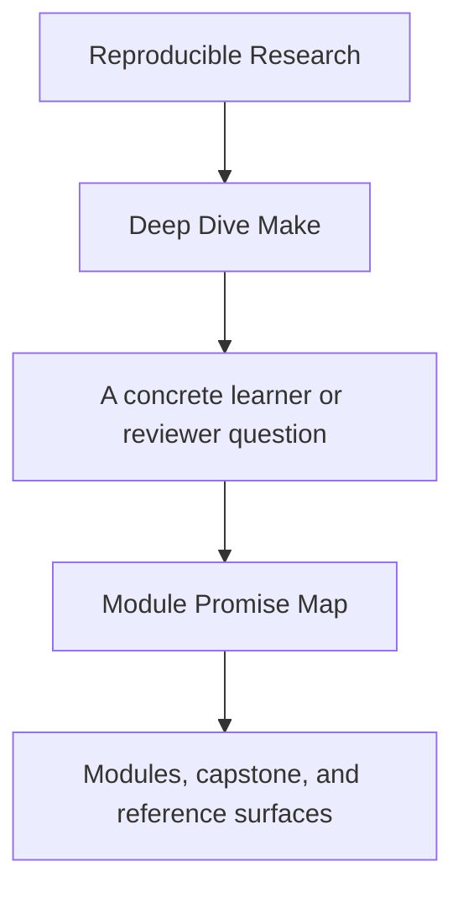
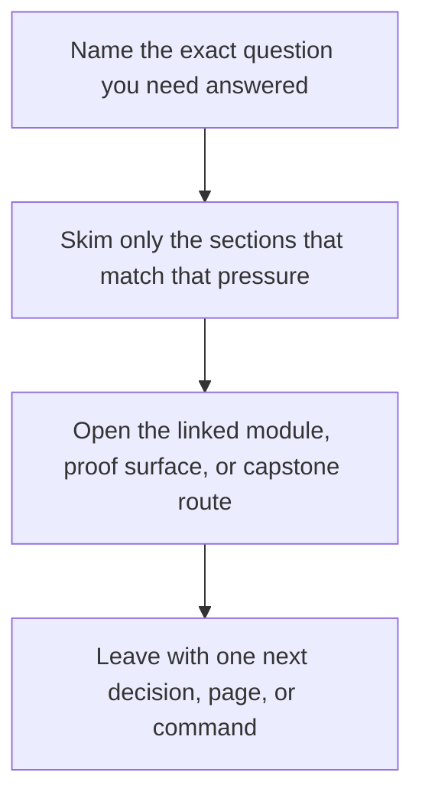

# Module Promise Map

<!-- page-maps:start -->
## Guide Fit

<!-- page-maps:end -->

Read the first diagram as a timing map: this guide is for a named pressure, not for wandering the whole course-book. Read the second diagram as the guide loop: arrive with a concrete question, use only the matching sections, then leave with one smaller and more honest next move.

Read the first diagram as a timing map: this guide is for a named pressure, not for wandering the whole course-book. Read the second diagram as the guide loop: arrive with a concrete question, use only the matching sections, then leave with one smaller and more honest next move.

Read the first diagram as a timing map: this guide is for a named pressure, not for wandering the whole course-book. Read the second diagram as the guide loop: arrive with a concrete question, use only the matching sections, then leave with one smaller and more honest next move.

This page exists because strong module titles are not enough. A learner should be able to
ask, for every module, “what is this module promising me, and how will I know it was
delivered?”

Use this guide when a title sounds right but still feels too broad, too compressed, or
insufficiently tied to proof.

---

## How To Read This Page

Each row names four things:

* the module promise
* the boundary of that promise
* the learner outcome the module should leave behind
* the first honest capstone corroboration route

If a module page drifts away from this contract, the drift should become visible here.

[Back to top](#top)

---

## Promise Table

| Module | Promise | Boundary | Learner outcome | First corroboration |
| --- | --- | --- | --- | --- |
| 01 Foundations | teach Make as a truthful build graph, not as shell glue | targets, prerequisites, rebuild causes, atomic publication | explain why a target rebuilt and why false edges are dangerous | `capstone-walkthrough` |
| 02 Scaling | teach parallel safety and controlled growth | ordering, rooted discovery, project structure, race classes | predict which builds will break under `-j` and why | `test` |
| 03 Production Practice | teach stable operational habits | selftests, deterministic behavior, CI discipline, public targets | name the proof surface that protects the build contract | `capstone-verify-report` |
| 04 Semantics Under Pressure | teach how Make behaves in incidents | precedence, includes, restarts, rule edge cases | debug tricky behavior without folklore | `capstone-tour` |
| 05 Hardening | teach platform and environment boundaries | portability, jobserver, modeled non-file inputs, failure containment | explain which assumptions must be declared instead of implied | `capstone-contract-audit` |
| 06 Generated Files | teach generators and multi-output boundaries honestly | generated headers, manifests, pipeline edges, coupled outputs | trace a generator from declared inputs to trusted outputs | `proof` |
| 07 Build Architecture | teach layered build design without private-language drift | public targets, includes, macros, `mk/*.mk` ownership | identify which layer should absorb a change | `inspect` |
| 08 Release Engineering | teach publish trust and artifact boundaries | bundles, manifests, install surfaces, attestations | review whether an artifact is safe to trust downstream | `proof` |
| 09 Incident Response | teach diagnosis under operational pressure | performance, traces, review bundles, failure ladders | move from symptom to owning boundary with less guesswork | `capstone-incident-audit` |
| 10 Make Boundaries | teach stewardship and migration judgment | governance, anti-patterns, handoff boundaries, review method | decide whether Make should keep owning the problem | `capstone-confirm` |

[Back to top](#top)

---

## Promise Failures This Page Guards Against

When module titles are strong but unchecked, courses usually fail in one of four ways:

* the title promises judgment, but the module only delivers syntax
* the title promises operations, but the proof routes stay abstract
* the title promises architecture, but ownership remains blurry
* the title promises release or governance, but the capstone surface never corroborates it

This page makes those failures visible before they harden into course drift.

[Back to top](#top)

---

## Best Companion Pages

Use these pages with the promise map:

* [`course-guide.md`](course-guide.md) for the stable learner hub
* [`module-checkpoints.md`](module-checkpoints.md) for the end-of-module review bar
* [`proof-matrix.md`](proof-matrix.md) for claim-to-evidence routing
* [`capstone-map.md`](capstone-map.md) for module-to-capstone entry routes

[Back to top](#top)
