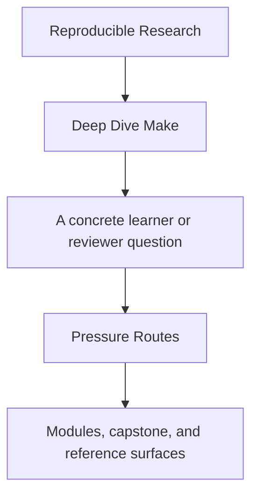
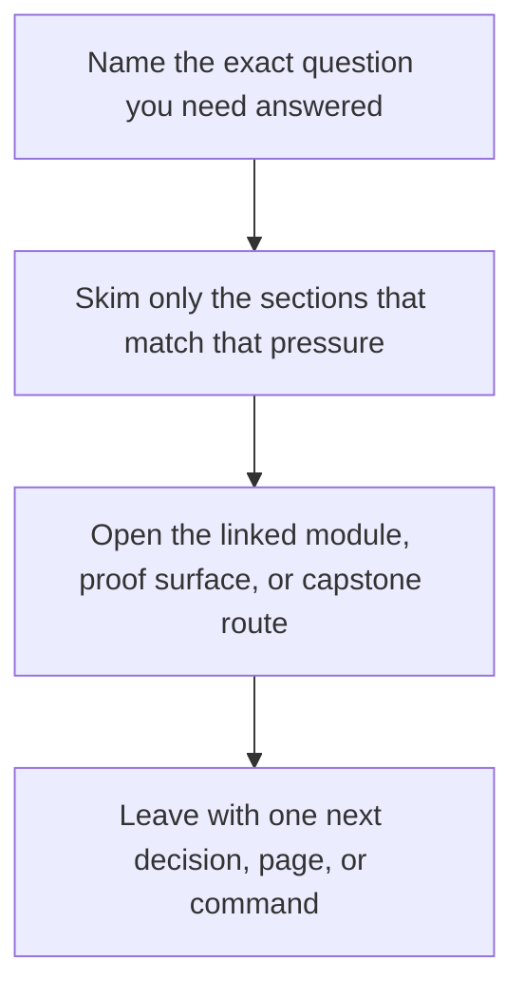

# Pressure Routes

<!-- page-maps:start -->
## Guide Fit

<!-- page-maps:end -->

Read the first diagram as a timing map: this guide is for a named pressure, not for wandering the whole course-book. Read the second diagram as the guide loop: arrive with a concrete question, use only the matching sections, then leave with one smaller and more honest next move.

Read the first diagram as a timing map: this guide is for a named pressure, not for wandering the whole course-book. Read the second diagram as the guide loop: arrive with a concrete question, use only the matching sections, then leave with one smaller and more honest next move.

Read the first diagram as a timing map: this guide is for a named pressure, not for wandering the whole course-book. Read the second diagram as the guide loop: arrive with a concrete question, use only the matching sections, then leave with one smaller and more honest next move.

This page fixes a human problem, not a technical one: learners do not always arrive with
the calm, ideal “read everything in order” mindset. Sometimes they are new. Sometimes
they are on-call. Sometimes they are inheriting a dangerous build.

Use this page when your pressure is shaping what you can realistically read.

---

## Four Common Pressures

| Pressure | What you need first | Best route |
| --- | --- | --- |
| first contact | a safe mental model and low cognitive load | `start-here` -> Module 00 -> Modules 01-02 -> `capstone-walkthrough` |
| inherited build repair | fast diagnosis and high-value repairs | Module 04 -> Module 05 -> Module 09 -> `capstone-contract-audit` |
| release and stewardship | public contracts, packaging, migration judgment | Module 03 -> Module 07 -> Module 08 -> Module 10 -> `proof` |
| incident pressure | quickest route from symptom to owning boundary | Module 09 -> `incident-ladder` -> `capstone-incident-audit` |

[Back to top](#top)

---

## Route Details

### First Contact

Use this when Make still feels foreign.

1. [`start-here.md`](start-here.md)
2. [`module-00-orientation/index.md`](../module-00-orientation/index.md)
3. Modules 01 and 02
4. [`module-checkpoints.md`](module-checkpoints.md)
5. [`capstone-walkthrough.md`](../capstone/capstone-walkthrough.md)

### Inherited Build Repair

Use this when you already have a failing or brittle build.

1. [`anti-pattern-atlas.md`](../reference/anti-pattern-atlas.md)
2. Module 04
3. Module 05
4. Module 09
5. [`capstone/capstone-map.md`](../capstone/capstone-map.md)

### Release And Stewardship

Use this when the concern is downstream trust and long-lived ownership.

1. Module 03
2. Module 07
3. Module 08
4. Module 10
5. [`proof-ladder.md`](proof-ladder.md), then `capstone-confirm`

### Incident Pressure

Use this when a build already failed and you need the shortest route to responsible diagnosis.

1. [`incident-ladder.md`](../reference/incident-ladder.md)
2. Module 09
3. [`public-targets.md`](../reference/public-targets.md)
4. [`capstone/capstone-map.md`](../capstone/capstone-map.md)
5. `capstone-incident-audit`

[Back to top](#top)

---

## Pressure Mistakes This Page Prevents

This page exists to prevent these clumsy reading mistakes:

* starting in Module 08 when the real problem is still graph truth
* using the capstone as first exposure during panic
* reading every support page when one pressure-specific route would do
* treating governance pages as a substitute for repair knowledge

[Back to top](#top)

---

## Best Companion Pages

Use these with the pressure routes:

* [`course-guide.md`](course-guide.md) for the stable support hub
* [`module-promise-map.md`](module-promise-map.md) to keep titles honest
* [`proof-ladder.md`](proof-ladder.md) to size proof correctly
* [`topic-boundaries.md`](../reference/topic-boundaries.md) to know what the course does and does not center

[Back to top](#top)
